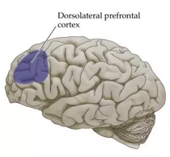

## Dorsolateral prefrontal cortex

Our sense of justice is underwritten in the right dorsolateral prefrontal cortex. With inactivation of this area, we act more selfishly. This is probably related to the right [frontal lobe](Frontal%20lobe.md)'s capacity to see the other's point of view ([The right hemisphere is responsible for the ability to put ourselves in anothers shoes](The%20right%20hemisphere%20is%20responsible%20for%20the%20ability%20to%20put%20ourselves%20in%20anothers%20shoes.md)), and for empathy in general ([The right hemisphere is responsible for our capacity for emotional understanding](The%20right%20hemisphere%20is%20responsible%20for%20our%20capacity%20for%20emotional%20understanding.md)). The right frontal lobe's capacity to inhibit our natural impulse to selfishness means that it is also the area on which we most rely for self-control and the power to resist temptation.

---

##### References

* Mcgilchrist, Iain. (2010). [The Master and His Emissary Chapter 2. What Do the Hemispheres Do?](The%20Master%20and%20His%20Emissary%20Chapter%202.%20What%20Do%20the%20Hemispheres%20Do%3F.md) (p. 173). London, UK: *Yale University Press*.

##### Metadata

Type: #🔴 
Tags: [Biology]() / [Neuroscience](Neuroscience.md) / [Anatomy]() / [Neuroanatomy](Neuroanatomy.md)
Status: #☀️ 
