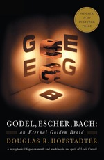

## Godel, Escher, Bach An Eternal Golden Braid

Author: [Douglas R. Hofstadter]()
Publisher: New York, NY: *Basic Books*.
Publish Date: 1979
Status: #💫/⏳ 
Rating:

---

### Nebulas

[Inbox scrap 46](Inbox%20scrap%2046.md)

* [Godel Escher Bach Introduction A Musico-Logical Offering](Godel%20Escher%20Bach%20Introduction%20A%20Musico-Logical%20Offering.md)
* [Godel Escher Bach Chapter 1 The MU Puzzle](Godel%20Escher%20Bach%20Chapter%201%20The%20MU%20Puzzle.md)
* [Godel Escher Bach Chapter 2 Meaning and Form in Mathematics](Godel%20Escher%20Bach%20Chapter%202%20Meaning%20and%20Form%20in%20Mathematics.md)
* [Godel, Escher, Bach Chapter 3. Figure and Ground](Godel,%20Escher,%20Bach%20Chapter%203.%20Figure%20and%20Ground.md)
* [Godel, Escher, Bach Chapter 9. Mumon and Godel](Godel,%20Escher,%20Bach%20Chapter%209.%20Mumon%20and%20Godel.md)

### Notes

Amount: 6

* [Intelligence](Intelligence.md)
* [Humans differ from machines in that they are able to make observations about their own behavior](Humans%20differ%20from%20machines%20in%20that%20they%20are%20able%20to%20make%20observations%20about%20their%20own%20behavior.md)
* [Intelligent mode](Intelligent%20mode.md)
* [Mechanic mode](Mechanic%20mode.md)
* [Jump out of the system](Jump%20out%20of%20the%20system.md)
* [Theorem](Theorem.md)
* [Isomorphism](Isomorphism.md)
