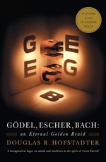

\<- [Godel Escher Bach An Eternal Golden Braid](Godel%20Escher%20Bach%20An%20Eternal%20Golden%20Braid.md)

## Godel, Escher, Bach Chapter 3. Figure and Ground

Author: [Douglas R. Hofstadter]()
Publisher: New York, NY: *Basic Books*.
Publish Date: 1979
Review Date:
Status: #💥/⌛️ 

---

### Annotations

[Inbox scrap 46](Inbox%20scrap%2046.md)

72

THERE IS A strangeness to the idea that concepts can be captured by simple typographical manipulations. The one concept so far captured is that of addition, and it may not have appeared very strange. But suppose the goal were to create a formal system with theorems of the form Px, the letter 'x' standing for a hyphen-string, and where the   
only such theorems would be ones in which the hyphen-string contained exactly a prime number of hyphens. Thus, P--- would be a theorem, but P---- would not. How could this be done typographically? First, it is important to specify clearly what is meant by typographical operations. The complete repertoire has been presented in the MIU-system   
and the pq-system, so we really only need to make a list of the kinds of things we have permitted: 

(1) reading and recognizing any of a finite set of symbols;   
(2) writing down any symbol belonging to that set;   
(3) copying any of those symbols from one place to another;   
(4) erasing any of those symbols;   
(5) checking to see whether one symbol is the same as another;   
(6) keeping and using a list of previously generated theorems. 

The list is a little redundant, but no matter. What is important is that it clearly involves only trivial abilities, each of them far less than the ability to distinguish primes from nonprimes. How, then, could we compound some of these operations to make a formal system in which primes are distinguished from composite numbers?

---

72

A first step might be to try to solve a simpler, but related, problem. We could try to make a system similar to the pq-system, except that it represents multiplication, instead of   
addition. Let's call it the tq-system, 't' for times'. More specifically, suppose X, Y, and Z are, respectively, the numbers of hyphens in the hyphen-strings x, y, and z. (Notice I am taking special pains to distinguish between a string and the number of hyphens it contains.) Then we wish the string x ty q z to be a theorem if and only if X times Y   
equals Z. For instance, --t---q----- should be a theorem because 2 times 3 equals 6, but --t--q--- should not be a theorem. The tq-system can be characterized just about as easily as the pq-system namely, by using just one axiom schema and one rule of inference:

73

AXIOM SCHEMA: xt-qx is an axiom, whenever x is a hyphen string. 

RULE OF INFERENCE: Suppose that x, y, and z  
are all hyphen-strings. An suppose that x ty qz is an old theorem. Then, xty-qzx is a new theorem. 

Below is the derivation of the theorem --t---q----- :

(1) --t-q-- (axiom)   
(2) --t—q---- (by rule of inference, using line (1) as the old theorem)   
(3) --t---q ------- (by rule of inference, using line (2) as the old theorem) 

Notice how the middle hyphen-string grows by one hyphen each time the rule of inference is applied; so it is predictable that if you want a theorem with ten hyphens in   
the middle, you apply the rule of inference nine times in a row.

---

73

Multiplication, a slightly trickier concept than addition, has now been "captured" typographically, like the birds in Escher's Liberation. What about primeness? Here's a   
plan that might seem smart: using the tq-system define a new set of theorems of the form Cx, which characterize composite numbers, as follows: 

RULE: Suppose x, y, and z are hyphen-strings. If x-ty-qz is a theorem then Cz is a theorem. 

This works by saying that Z (the number of hyphens in z) is composite aa long as it is the product of two numbers greater than 1-namely, X + (the number of hyphens in x-), and Y + 1 (the number of hyphens in y I am defending this new rule by giving you some "Intelligent mode justifications for it. That is because you are a human being, and want to know why there is such a rule. If you were operating exclusively in the "Mechanical mode", you would not need any justification, since M-mode workers just follow the rules mechanically and happily, never questioning; them!

---

73

Because you work in the I-mode, you will tend to blur in your mind the distinction between strings and their interpretations. You see, things can become quite   
confusing as soon as you perceive "meaning" in the symbol which you are manipulating. You have to fight your own self to keep from thinking that the string'---' is the number 3. The Requirement of Formality, which in Chapter I probably seemed puzzling (because it seemed so obvious), here becomes tricky, and crucial. It is the essential thing which   
keeps you from mixing up the I-mode with the M-mode; or said another way, it keeps you from mixing up arithmetical facts with typographical theorems.

---

74

It is very tempting to jump from the C-type theorems directly to P-type theorems, by proposing a rule of the following kind: 

PROPOSED RULE: Suppose x is a hyphen-string. If Cx is not a theorem, then Px is a theorem. 

The fatal flaw here is that checking whether Cx is not a theorem is not an explicitly typographical operation. To know for sure that MU is not a theorem of the MIU-system,   
you have to go outside of the system ... and so it is with this Proposed Rule. It is a rule which violates the whole idea of formal systems, in that it asks you to operate informally-that is, outside the system. Typographical operation (6) allows you to look into the stockpile of previously found theorems, but this Proposed Rule is asking you to look into a hypothetical "Table of Nontheorems". But in order to generate such a table, you would have to do some reasoning outside the system-reasoning which shows why various strings cannot be generated inside the system. Now it may well be that there is another formal system which can generate the "Table of Nontheorems", by purely typographical means. In fact, our aim is to find just such a system. But the Proposed Rule is not a typographical   
rule, and must be dropped.

---

74

This is such an important point that we might dwell on it a bit more. In our C-system (which includes the tq-system and the rule which defines C-type theorems), we have theorems of the form Cx, with 'x' standing, as usual, for a hyphen-string. There are also nontheorems of the form Cx. (These are what I mean when I refer to "nontheorems", although of course tt-Cqq and other ill-formed messes are also nontheorems.) The difference is that theorems have a composite number of hyphens, nontheorems have a prime number of hyphens. Now the theorems all have a common "form", that is, originate from a common set of typographical rules. Do all nontheorems also have a common   
"form", in the same sense? Below is a list of C-type theorems, shown without their derivations. The parenthesized numbers following them simply count the hyphens in them. 

C ---- (4) 
C -------- (6) 
C ----------------(8) 
C -----------------(9) 
C --------------------(10) 
C -------------------- (12) 
C ------------------------ (14) 
C ------------------------ (15) 
C ----------------------------(16) 
C ------------------------------ (18)

75

The "holes" in this list are the nontheorems. To repeat the earlier question: Do the holes also have some "form" in common? Would it be reasonable say that merely by virtue of being the holes in this list, they share a common form? Yes and no. That they share some typographical quality is and able, but whether we want to call it "form" is unclear. The   
reason hesitating is that the holes are only negatively   
defined-they are the things that are left out of a list which is *positively* defined

---

75

Figure and Ground 

This recalls the famous artistic distinction between figure and ground. When a figure or "positive space" (e.g., a human form, or a letter, or a still life is drawn inside a frame, an unavoidable consequence is that its complementary shape-also called the "ground", or   
"background", or "negative space"-has also been drawn. In most drawings, however, this figure ground relationship plays little role. The artist is much less interested in ground than in the figure. But sometimes, an artist will take interest in ground as well.

75

There are beautiful alphabets which play with this figure-ground distinction. A message written in such an alphabet is shown below. At first it looks like a collection of   
somewhat random blobs, but if you step back a ways and stare at it for a while, all of a sudden, you will see seven letters appear in this:

75

FIGURE 15.

75

For a similar effect, take a look at my drawing Smoke Signal   
(Fig. 139). Along these lines, you might consider this puzzle: can you somehow create a drawing containing   
words in both the figure and the ground?

---

75

Let us now officially distinguish between two kinds of figures: cursively drawable ones, and recursive ones (by the way, these are my own terms are not in common usage). A cursively drawable figure is one whose ground is merely an accidental by-product of the drawing act. A recursive   
figure is one whose ground can be seen as a figure in its own right. Usually this is quite deliberate on the part of the artist. The "re" in "recursive" represents the fact that both foreground and background are cursively drawable – the figure is "twice-cursive". Each figure-ground boundary in a recursive figure is a double-edged sword. M. C. Escher was a master at drawing recursive figures-see, for instance, his beautiful recursive drawing of birds (Fig. 16)

76

FIGURE 16. Tiling of the plane using birds, by M. C. Escher (from a 1942 notebook)

---

76

Our distinction is not as rigorous as one in mathematics, for who can definitively say that a particular ground is not a figure? Once pointed out, almost any ground has interest of its own. In that sense, every figure is recursive. But that is not what I intended by the term. There is a natural and intuitive notion of recognizable forms. Are both the   
foreground and background recognizable forms? If so, then the drawing is recursive. If you look at the grounds of most line drawings, you will find them rather unrecognizable.   
This demonstrates that 

There exist recognizable forms whose negative space is not any recognizable form. 

In more "technical" terminology, this becomes: 

There exist cursively drawable figures which are not recursive

---

76

Scott Kim's solution to the above puzzle, which I call his "FIGURE-FIGURE Figure", is shown in Figure 17. If you read both black and white.

77

FIGURE 17. FIGURE-FIGURE Figure, by Scott E. Kim (1975).

78

you will see "FIGURE" everywhere, but "GROUND" nowhere! It is a paragon of recursive figures. In this clever drawing, there are two nonequivalent ways of characterizing the black regions: 

(1) as the negative space to the white regions; 
(2) as altered copies of the white regions (produced by coloring and shifting each white region)

---

78

(In the special case of the FIGURE-FIGURE Figure, the two characterizations are equivalent-but in most black-and-white pictures, they would not be.) Now in Chapter VIII, when we create our Typographical Number Theory (TNT)  
, it will be our hope that the set of all false statements of number theory can be characterized in two analogous ways: 

(1) as the negative space to the set of all TNT-theorems;   
(2) as altered copies of the set of all TNT theorems (produced by negating each TNT-theorem). 

But this hope will be dashed, because: 

(1) inside the set of all nontheorems are found some truths   
(2) outside the set of all negated theorems are found some falsehoods.

You will see why and how this happens, in Chapter XIV. Meanwhile, ponder over a pictorial representation of the situation (Fig. 18.)

FIGURE 18. Considerable visual symbolism is featured in this diagram of the relationship between various classes of TNT strings. The biggest box represents the set of all TNT strings. The next-biggest box represents the set of all well-formed TNT strings. Within it is found the set of all sentences of TNT. Now things begin to get interesting. The set of theorems is pictured as a tree growing out of a trunk (representing the set of axioms). The tree-symbol was chosen because of the recursive growth pattern which it exhibits: new branches (theorems) constantly sprouting from old ones. The fingerlike branches probe into the corners of the constraining region (the set of truths), yet can never fully occupy it. The boundary between the set of truths and the set of falsities is meant to suggest a randomly meandering coastline which, no matter how closely you examine it, always has finer levels of structure, and is consequently impossible to describe exactly in any finite way. (See B. Mandelbrot's book Fractals.) The reflected tree represents the set of negations of theorems: all of them false, yet unable collectively to span the space of false statements. \[ Drawing by the author.\]

---

78

One may also look for figures and grounds in music. One analogue is the distinction between melody and accompaniment-for the melody is always in the forefront of our attention, and the accompaniment is subsidiary, in some sense. Therefore it is surprising when we find, in the lower lines of a piece of music, recognizable melodies. This does   
not happen too often in post-baroque music. Usually the harmonies are not thought of as foreground. But in baroque music-in Bach above all-the distinct lines, whether high or low or in between, all act as "figures". In this sense, pieces by Bach can be called "recursive"

---

78

Another figure-ground distinction exists in music: that between on-beat and off-beat. If you count notes in a measure "one-and, two-and, three-and, four-and", most   
melody-notes will come on numbers, not on "and"'s. But sometimes, a melody will be  deliberately pushed onto the "and" 's, for the sheer effect of it. This occurs in several etudes for the piano by Chopin, for instance. It also occurs in Bach-particularly in his Sonatas and Partitas for unaccompanied violin, and his Suites for unaccompanied cello. There, Bach manages to get two or more musical lines going simultaneously. Sometimes he does this by having the solo instrument play "double stops"-two notes at once. Other times, however, he puts one voice on the on-beats, and the other voice on the off-beats, so ear separates them   
and hears two distinct melodies weaving in and out, - harmonizing with each other. Needless to say, Bach didn't stop at this level of complexity...

---

79

Now let us carry back the notions of figure and ground to the domain formal systems. In our example, the role of positive space is played by C-type theorems, and the   
role of negative space is played by strings with a prime number of hyphens. So far, the only way we have found to represent prime numbers typographically is as a negative space. Is there, however, some way-I don't care   
how complicated-of representing the primes as a positive   
space-that is, as a set of theorems of some formal system?

80

Different people's intuitions give different answers here. I remember quite vividly how puzzled and intrigued I was upon realizing the difference between a positive characterization and a negative characterization. I was quite convinced that not only the primes, but any set of numbers which could be represented negatively, could also be represented positively. The intuition underlying my belief is represented by the question: "How could a figure and its ground not carry exactly the same information?" They seemed to me to embody the same information, just coded in two complementary ways. What seems right to you?   
It turns out I was right about the primes, but wrong in general. This astonished me, and continues to astonish me even today. It is a fact that: 

There exist formal systems whose negative space (set of nontheorems) is not the positive space (set of theorems) of any formal system. 

This result, it turns out, is of depth equal to Gödel’s Theorem-so it is not surprising that my intuition was upset. I, just like the mathematicians of the early twentieth century, expected the world of formal systems and natural numbers to be more predictable than it is. In more technical terminology, this becomes: 

There exist recursively enumerable sets which are not recursive. 

The phrase recursively enumerable (often abbreviated "r.e.") is the mathematical counterpart to our artistic notion of "cursively drawable"-and recursive is the counterpart of "recursive". For a set of strings to be "r.e." means that it can be generated according to typographical rules-for example, the set of C-type theorems, the set of theorems of the MIU-system-indeed, the set of theorems of any formal system. This could be compared with the conception of a "figure" as "a set of lines which can be generated according to artistic rules" (whatever that might mean!). And a "recursive set" is like a figure whose ground is also a figure-not only is it r.e., but its complement is also r.e.

---

### Notes
