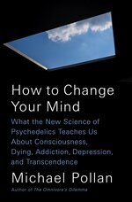

\<- [📚 The Library](🔮%20The%20Cosmos/The%20Library.md)
\<- [How to Change Your Mind What the New Science of Psychedelics Teaches Us About Consciousness, Dying, Addiction, Depression, and Transcendence](How%20to%20Change%20Your%20Mind%20What%20the%20New%20Science%20of%20Psychedelics%20Teaches%20Us%20About%20Consciousness,%20Dying,%20Addiction,%20Depression,%20and%20Transcendence.md)

## How to Change Your Mind Chapter 5. The Neuroscience Your Brain on Psychedelics

Author: [Micheal Pollan]()
Publisher: New York, NY: *Penguin Random House*. 
Publish Date: 2018
Review Date:
Status: #☁️/📚 

---

### Annotations

Highlight(pink) - Location 3987

A tryptamine is a type of organic compound (an indole, to be exact) distinguished by the presence of two linked rings, one of them with six atoms and the other with five. Living nature is awash in tryptamines, which show up in plants, fungi, and animals, where they typically act as signaling molecules between cells. The most famous tryptamine in the human body is the neurotransmitter serotonin, the chemical name of which is 5-hydroxytryptamine.

Highlight(pink) - Location 3992

it binds with a dozen or so different receptors, and these are found not only across many parts of the brain but throughout the body, with a substantial representation in the digestive tract.

Highlight(pink) - Location 3993

Depending on the type of receptor in question and its location, serotonin is liable to make very different things happen—sometimes exciting a neuron to fire, other times inhibiting it.

---

Highlight(pink) - Location 3995

The group of tryptamines we call “the classical psychedelics” have a strong affinity with one particular type of serotonin receptor, called the 5-HT2A. These receptors are found in large numbers in the human cortex, the outermost, and evolutionarily most recent, layer of the brain. Basically, the psychedelics resemble serotonin closely enough that they can attach themselves to this receptor site in such a way as to activate it to do various things.

---

Highlight(pink) - Location 3999

Curiously, LSD has an even stronger affinity with the 5-HT2A receptor—is “stickier”—than serotonin itself, making this an instance where the simulacrum is more convincing, chemically, than the original.

Highlight(pink) - Location 4001

This has led some scientists to speculate that the human body must produce some other, more bespoke chemical for the express purpose of activating the 5-HT2A receptor—perhaps an endogenous psychedelic that is released under certain circumstances, perhaps when dreaming.

Highlight(pink) - Location 4003

One candidate for that chemical is the psychedelic molecule DMT, which has been found in trace amounts in the pineal gland of rats.

---

Highlight(pink) - Location 4004

The science of serotonin and LSD has been closely intertwined since the 1950s; in fact, it was the discovery that LSD affected consciousness at such infinitesimal doses that helped to advance the new field of neurochemistry in the 1950s, leading to the development of the SSRI antidepressants.

Highlight(pink) - Location 4006

But it wasn’t until 1998 that Franz Vollenweider, a Swiss researcher who is one of the pioneers of psychedelic neuroscience, demonstrated that psychedelics like LSD and psilocybin work on the human brain by binding with the 5-HT2A receptors. He did this by giving subjects a drug called ketanserin that blocks the receptor; when he then administered psilocybin, nothing happened.

---

Highlight(pink) - Location 4018

Sigmund Freud wrote that “there is nothing of which we are more certain than the feeling of our self, our own ego.”

Highlight(pink) - Location 4019

Yet it is difficult to be quite so certain that anyone else possesses consciousness, much less other creatures, because there is no outward physical evidence that consciousness as we experience it exists.

Highlight(pink) - Location 4020

The thing of which we are most certain is beyond the reach of our science, supposedly our surest way of knowing anything.

Highlight(pink) - Location 4021

This dilemma has left ajar a door through which writers and philosophers have stepped. The classic thought experiment to determine whether another being is in possession of consciousness was proposed by Thomas Nagel, a philosopher, in a famous 1974 paper, “What Is It Like to Be a Bat?” He argued that if “there is something that it is like to be a bat”—if there is any subjective dimension to bat experience—then a bat possesses consciousness. He went on to suggest that this “what it is like” quality may not be reducible to material terms. Ever.

Highlight(pink) - Location 4025

Whether or not Nagel’s right about that is the biggest argument going in the field of consciousness studies. The question at its heart is often referred to as “the hard problem” or the “explanatory gap”: How do you explain mind—the subjective quality of experience—in terms of meat, that is, in terms of the physical structures or chemistry of the brain?

Highlight(pink) - Location 4028

The question assumes, as most (but not all) scientists do, that consciousness is a product of brains and that it will eventually be explained as the epiphenomenon of material things like neurons and brain structures, chemicals and communications networks. That would certainly seem to be the most parsimonious hypothesis. Yet it is a long way from being proven, and a number of neuroscientists question whether it ever will be: whether something as elusive as subjective experience—what it feels like to be you—will ever yield to the reductions of science.

---

Highlight(pink) - Location 4032

Some scientists have raised the possibility that consciousness may pervade the universe, suggesting we think of it the same way we do electromagnetism or gravity, as one of the fundamental building blocks of reality.

Note - Location 4034

Which is basically just a reemergence of Brahman pansychism. It doesn’t make any sense either because without the six sense bases consciousness can literally not be discerned. Consciousness is a phenomenal condition of the six senses. How can manifest without them? What are these scientists even referring to as consciousness anyways? If it’s this sense of self as Micheal proposes, then this is literally just brahmanism

---

Highlight(pink) - Location 4034

The idea that psychedelic drugs might shed some light on the problems of consciousness makes a certain sense. A psychedelic drug is powerful enough to disrupt the system we call normal waking consciousness in ways that may force some of its fundamental properties into view.

Note

It does, because it demostrates that the disticition between mind and body is artificlial. It is really [Mind-body](Mind-body.md). And [neural activity changes in accordance with mental activity](Neural%20activity%20changes%20in%20accordance%20with%20mental%20activity.md). Thus, when psychedelics interfear with neural functioning, it effects consciousness.

Highlight(pink) - Location 4036

True, anesthetics disrupt consciousness too, yet because such drugs shut it down, this kind of disturbance yields relatively little data.

Highlight(pink) - Location 4037

In contrast, someone on a psychedelic remains awake and able to report on what he or she is experiencing in real time. Nowadays, these subjective reports can be correlated with various measures of brain activity, using several different modes of imaging—tools unavailable to researchers during the first wave of psychedelic research in the 1950s and 1960s.

---

Highlight(pink) - Location 4042 

PERHAPS THE MOST AMBITIOUS neuroscientific expedition using psychedelics to map the terrain of human consciousness is taking place in a laboratory at the Centre for Psychiatry on the Hammersmith campus of Imperial College in West London.

Highlight(pink) - Location 4057

“If the only way we can access the unconscious is via dreams and free association,” he explained the first time we talked, “we aren’t going to get anywhere. Surely there must be something else.”

Highlight(pink) - Location 4060

His professor sent him to read a book called Realms of the Human Unconscious by Stanislav Grof. “I went to the library and read the book cover to cover. I was blown away. That set the course for the rest of my young life.” Carhart-Harris,

Highlight(pink) - Location 4063

he would use psychedelic drugs and modern brain-imaging technologies to build a foundation of hard science beneath the edifice of psychoanalysis.

Highlight(pink) - Location 4064

“Freud said dreams were the royal road to the unconscious,” he reminded me. “Psychedelics could turn out to be the superhighway.”

Highlight(pink) - Location 4066

He likes to quote Grof’s grand claim that what the telescope was for astronomy, or the microscope for biology, psychedelics will be for understanding the mind.

Note - Location 4067

Add meditation along with psychedelics

---

Highlight(pink) - Location 4074

Feilding has had a long-standing interest in altered states of consciousness and, specifically, the role of blood flow to the brain, which in Homo sapiens, she believes, has been compromised ever since our species began standing upright.

Highlight(pink) - Location 4075

LSD, Feilding believes, enhances cognitive function and facilitates higher states of consciousness by increasing cerebral circulation.

Highlight(pink) - Location 4076

A second way to achieve a similar result is by means of the ancient practice of trepanation. This deserves a brief digression.

Highlight(pink) - Location 4077

Trepanation involves drilling a shallow hole in the skull supposedly to improve cerebral blood circulation; in effect, it reverses the fusing of the cranial bones that happens in childhood.

Highlight(pink) - Location 4079

Trepanation was for centuries a common medical procedure, to judge by the number of ancient skulls that have turned up with neat holes in them.

---

Highlight(pink) - Location 4114

Carhart-Harris’s working hypothesis was that their brains would exhibit increases in activity, particularly in the emotion centers. “I thought it would look like the dreaming brain,” he told me.

Highlight(pink) - Location 4115

Employing a different scanning technology, Franz Vollenweider had published data indicating that psychedelics stimulated brain activity, especially in the frontal lobes. (An area responsible for executive and other higher cognitive functions.)

Highlight(pink) - Location 4117

But when the first set of data came in, Carhart-Harris got a surprise: “We were seeing decreases in blood flow”—blood flow being one of the proxies for brain activity that fMRI measures. “Had we made a mistake? It was a real head-scratcher.”

Highlight(pink) - Location 4119

But the initial data on blood flow was corroborated by a second measure that looks at changes in oxygen consumption to pinpoint areas of elevated brain activity. Carhart-Harris and his colleagues had discovered that psilocybin reduces brain activity, with the falloff concentrated in one particular brain network that at the time he knew little about: the default mode network.

---

Highlight(pink) - Location 4122

The default mode network, or DMN, was not known to brain science until 2001. That was when Marcus Raichle, a neurologist at Washington University, described it in a landmark paper published in the Proceedings of the National Academy of Sciences, or PNAS. The network forms a critical and centrally located hub of brain activity that links parts of the cerebral cortex to deeper (and older) structures involved in memory and emotion.\*

Highlight(pink) - Location 4127

The typical fMRI experiment begins by establishing a “resting state” baseline for neural activity as the volunteer sits quietly in the scanner awaiting whatever tests the researcher has in store. Raichle had noticed that several areas in the brain exhibited heightened activity precisely when his subjects were doing nothing mentally. This was the brain’s “default mode,” the network of brain structures that light up with activity when there are no demands on our attention and we have no mental task to perform.

Highlight(pink) - Location 4130

Put another way, Raichle had discovered the place where our minds go to wander—to daydream, ruminate, travel in time, reflect on ourselves, and worry.

Highlight(pink) - Location 4131

It may be through these very structures that the stream of our consciousness flows.

Highlight(pink) - Location 4132

The default network stands in a kind of seesaw relationship with the attentional networks that wake up whenever the outside world demands our attention; when one is active, the other goes quiet, and vice versa.

Highlight(pink) - Location 4133

But as any person can tell you, quite a lot happens in the mind when nothing much is going on outside us. (In fact, the DMN consumes a disproportionate share of the brain’s energy.)

Highlight(pink) - Location 4134

Working at a remove from our sensory processing of the outside world, the default mode is most active when we are engaged in higher-level “metacognitive” processes such as self-reflection, mental time travel, mental constructions (such as the self or ego), moral reasoning, and “theory of mind”—the ability to attribute mental states to others, as when we try to imagine “what it is like” to be someone

Highlight(pink) - Location 4137

All these functions may belong exclusively to humans, and specifically to adult humans, for the default mode network isn’t operational until late in a child’s development.

Highlight(pink) - Location 4139

“The brain is a hierarchical system,” Carhart-Harris explained in one of our interviews. “The highest-level parts”—those developed late in our evolution, typically located in the cortex—“exert an inhibitory influence on the lower-level \[and older\] parts, like emotion and memory.”

Highlight(pink) - Location 4141

As a whole, the default mode network exerts a top-down influence on other parts of the brain, 
many of which communicate with one another through its centrally located hub.

Highlight(pink) - Location 4142

Robin has described the DMN variously as the brain’s “orchestra conductor,” “corporate executive,” or “capital city,” charged with managing and “holding the whole system together.” And with keeping the brain’s unrulier tendencies in check.

Highlight(pink) - Location 4144

The brain consists of several different specialized systems—one for visual processing, for example, another to control motor activity—each doing its own thing. “Chaos is averted because all systems are not created equal,” Marcus Raichle has written. “Electrical signaling from some brain areas takes precedence over others. At the top of this hierarchy resides the DMN, which acts as an uber-conductor to ensure that the cacophony of competing signals from one system do not interfere with those from another.” The default mode network keeps order in a system so complex it might otherwise descend into the anarchy of mental illness.

Highlight(pink) - Location 4148

As mentioned, the default mode network appears to play a role in the creation of mental constructs or projections, the most important of which is the construct we call the self, or ego.\* This is why some neuroscientists call it “the me network.”

Highlight(pink) - Location 4150

If a researcher gives you a list of adjectives and asks you to consider how they apply to you, it is your default mode network that leaps into action. (It also lights up when we receive “likes” on our social media feeds.)

Highlight(pink) - Location 4152

Nodes in the default network are thought to be responsible for autobiographical memory, the material from which we compose the story of who we are, by linking our past experiences with what happens to us and with projections of our future goals.

Highlight(pink) - Location 4154

The achievement of an individual self, a being with a unique past and a trajectory into the future, is one of the glories of human evolution, but it is not without its drawbacks and potential disorders.

Highlight(pink) - Location 4155

The price of the sense of an individual identity is a sense of separation from others and nature.

Highlight(pink) - Location 4156

Self-reflection can lead to great intellectual and artistic achievement but also to destructive forms of self-regard and many types of unhappiness. (In an often-cited paper titled “A Wandering Mind Is an Unhappy Mind,” psychologists identified a strong correlation between unhappiness and time spent in mind wandering, a principal activity of the default mode network.)

---

Highlight(pink) - Location 4158

But, accepting the good with the bad, most of us take this self as an unshakable given, as real as anything we know, and as the foundation of our life as conscious human beings.

Highlight(pink) - Location 4160

Carhart-Harris’s first experiment was that the steepest drops in default mode network activity correlated with his volunteers’ subjective experience of “ego dissolution.” (“I existed only as an idea or concept,” one volunteer reported. Recalled another, “I didn’t know where I ended and my surroundings began.”)

Highlight(pink) - Location 4163

The more precipitous the drop-off in blood flow and oxygen consumption in the default network, the more likely a volunteer was to report the loss of a sense of self.\*

Highlight(pink) - Location 4164

Shortly after Carhart-Harris published his results in a 2012 paper in PNAS (“Neural Correlates of the Psychedelic State as Determined by fMRI Studies with Psilocybin”*), Judson Brewer, a researcher at Yale* who was using fMRI to study the brains of experienced meditators, noticed that his scans and Robin’s looked remarkably alike.

Highlight(pink) - Location 4167

The transcendence of self reported by expert meditators showed up on fMRIs as a quieting of the default mode network.

Highlight(pink) - Location 4168

It appears that when activity in the default mode network falls off precipitously, the ego temporarily vanishes,

Highlight(pink) - Location 4169

This sense of merging into some larger totality is of course one of the hallmarks of the mystical experience; our sense of individuality and separateness hinges on a bounded self and a clear demarcation between subject and object. But all that may be a mental construction, a kind of illusion—just as the Buddhists have been trying to tell us.

Highlight(pink) - Location 4172

The psychedelic experience of “non-duality” suggests that consciousness survives the disappearance of the self, that it is not so indispensable as we—and it—like to think.

---

Highlight(pink) - Location 4173

Carhart-Harris suspects that the loss of a clear distinction between subject and object might help explain another feature of the mystical experience: the fact that the insights it sponsors are felt to be objectively true—revealed truths rather than plain old insights. It could be that in order to judge an insight as merely subjective, one person’s opinion, you must first have a sense of subjectivity. Which is precisely what the mystic on psychedelics has lost.

---

Highlight(pink) - Location 4176

The mystical experience may just be what it feels like when you deactivate the brain’s default mode network.

Highlight(pink) - Location 4177

This can be achieved any number of ways: through psychedelics and meditation, as Robin Carhart-Harris and Judson Brewer have demonstrated, but perhaps also by means of certain breathing exercises (like holotropic breathwork), sensory deprivation, fasting, prayer, overwhelming experiences of awe, extreme sports, near-death experiences, and so on.

Highlight(pink) - Location 4181

This quieting might be accomplished by restricting blood flow to the network, or by stimulating the serotonin 2A receptors in the cortex,

---

Highlight(pink) - Location 4188

Taken as a whole, the default mode network exerts an inhibitory influence on other parts of the brain, notably including the limbic regions involved in emotion and memory, in much the same way Freud conceived of the ego keeping the anarchic forces of the unconscious id in check. (David Nutt puts the matter bluntly, claiming that in the DMN “we’ve found the neural correlate for repression.”)

Highlight(pink) - Location 4191

Carhart-Harris hypothesizes that these and other centers of mental activity are “let off the leash” when the default mode leaves the stage, and in fact brain scans show an increase in activity (as reflected by increases in blood flow and oxygen consumption) in several other brain regions, including the limbic regions, under the influence of psychedelics.

Highlight(pink) - Location 4193

This disinhibition might explain why material that is unavailable to us during normal waking consciousness now floats to the surface of our awareness, including emotions and memories and, sometimes, long-buried childhood traumas.

Note - Location 4194

Perhaps past life memories as well? 🤔

Highlight(pink) - Location 4194

It is for this reason that some scientists and psychotherapists believe psychedelics can be profitably used to surface and explore the contents of the unconscious mind.

---

Highlight(pink) - Location 4196 

But the default mode network doesn’t only exert top-down control over material arising from within; it also helps regulate what is let into consciousness from the world outside. It operates as a kind of filter (or “reducing valve”) charged with admitting only that “measly trickle” of information required for us to get through the day

Highlight(pink) - Location 4198

If not for the brain’s filtering mechanisms, the torrent of information the senses make available to our brains at any given moment might prove difficult to process—as indeed is sometimes the case during the psychedelic experience.

Highlight(pink) - Location 4200

“The question,” as David Nutt puts it, “is why the brain is ordinarily so constrained rather than so open?” The answer may be as simple as “efficiency.” Today most neuroscientists work under a paradigm of the brain as a prediction-making machine. To form a perception of something out in the world, the brain takes in as little sensory information as it needs to make an educated guess. We are forever cutting to the chase, basically, and leaping to conclusions, relying on prior experience to inform current perception.

Highlight(pink) - Location 4204

The mask experiment I attempted to perform during my psilocybin journey is a powerful demonstration of this phenomenon.

Highlight(pink) - Location 4204

when it is working normally, the brain, presented with a few visual clues suggesting it is looking at a face, insists on seeing the face as a convex structure even when it is not, because that’s the way faces usually are.

---

Highlight(pink) - Location 4206

The philosophical implications of “predictive coding” are deep and strange. The model suggests that our perceptions of the world offer us not a literal transcription of reality but rather a seamless illusion woven from both the data of our senses and the models in our memories.

Highlight(pink) - Location 4208

Normal waking consciousness feels perfectly transparent, and yet it is less a window on reality than the product of our imaginations—a kind of controlled hallucination.

Highlight(pink) - Location 4209

This raises a question: How is normal waking consciousness any different from other, seemingly less faithful productions of our imagination—such as dreams or psychotic delusions or psychedelic trips? In fact, all these states of consciousness are “imagined”: they’re mental constructs that weave together some news of the world with priors of various kinds.

Highlight(pink) - Location 4212

But in the case of normal waking consciousness, the handshake between the data of our senses and our preconceptions is especially firm. That’s because it is subject to a continual process of reality testing, as when you reach out to confirm the existence of the object in your visual field or, upon waking from a nightmare, consult your memory to see if you really did show up to teach a class without any clothes on. Unlike these other states of consciousness, ordinary waking consciousness has been optimized by natural selection to best facilitate our everyday survival.

Highlight(pink) - Location 4216

Indeed, that feeling of transparency we associate with ordinary consciousness may owe more to familiarity and habit than it does to verisimilitude. As a psychonaut acquaintance put it to me, “If it were possible to temporarily experience another person’s mental state, my guess is that it would feel more like a psychedelic state than a ‘normal’ state, because of its massive disparity with whatever mental state is habitual with you.”

Highlight(pink) - Location 4219

Another trippy thought experiment is to try to imagine the world as it appears to a creature with an entirely different sensory apparatus and way of life. You quickly realize there is no single reality out there waiting to be faithfully and comprehensively transcribed.

---

Highlight(pink) - Location 4221

Our senses have evolved for a much narrower purpose and take in only what serves our needs as animals of a particular kind. The bee perceives a substantially different spectrum of light than we do; to look at the world through its eyes is to perceive ultraviolet markings on the petals of flowers (evolved to guide their landings like runway lights) that don’t exist for

Highlight(pink) - Location 4223

That example is at least a kind of seeing—a sense we happen to share with bees. But how do we even begin to conceive of the sense that allows bees to register (through the hairs on their legs) the electromagnetic fields that plants produce? (A weak charge indicates another bee has recently visited the flower; depleted of nectar, it’s probably not worth a stop.)

Highlight(pink) - Location 4226

Then there is the world according to an octopus! Imagine how differently reality presents itself to a brain that has been so radically decentralized, its intelligence distributed across eight arms so that each of them can taste, touch, and even make its own “decisions” without consulting headquarters.

---

Highlight(pink) - Location 4230

I asked Carhart-Harris whether the tripping brain favors top-down predictions or bottom-up sensory data. “That’s the classic dilemma,” he suggested: whether the mind, unconstrained, will tend to favor its priors or the evidence of its senses. “You do often find a kind of impetuousness or overzealousness on the part of the priors, as when you see faces in the clouds.” Eager to make sense of the data rushing in, the brain leaps to erroneous conclusions and, sometimes, a hallucination results. (The paranoid does much the same thing, ferociously imposing a false narrative on the stream of incoming information.)

Highlight(pink) - Location 4234

But in other cases, the reducing valve opens wide to admit lots more information, unedited and sometimes welcome.

Highlight(pink) - Location 4235

People who are color-blind report being able to see certain colors for the first time when on psychedelics, and there is research to suggest that people hear music differently under the influence of these drugs. They process the timbre, or coloration, of music more acutely—a dimension of music that conveys emotion.

Highlight(pink) - Location 4237

When I listened to Bach’s cello suite during my psilocybin journey, I was certain I heard more of it than I ever had, registering shadings and nuances and tones that I hadn’t been able to hear before and haven’t heard since.

---

Highlight(pink) - Location 4239

Carhart-Harris thinks that psychedelics render the brain’s usual handshake of perception less stable and more slippery. The tripping brain may “slip back and forth” between imposing its priors and admitting the raw evidence of its senses.

Highlight(pink) - Location 4240

He suspects that there are moments during the psychedelic experience when confidence in our usual top-down concepts of reality collapses, opening the way for more bottom-up information to get through the filter.

Highlight(pink) - Location 4242

But when all that sensory information threatens to overwhelm us, the mind furiously generates new concepts (crazy or brilliant, it hardly matters) to make sense of it all—“and so you might see faces coming out of the rain.

Highlight(pink) - Location 4243

“That’s the brain doing what the brain does”—that is, working to reduce uncertainty by, in effect, telling itself stories.

Highlight(pink) - Location 4247

By adulthood, the brain has gotten very good at observing and testing reality and developing reliable predictions about it that optimize our investments of energy (mental and otherwise) and therefore our chances of survival. Uncertainty is a complex brain’s biggest challenge, and predictive coding evolved to help us reduce it.

---

Highlight(pink) - Location 4249

In general, the kind of precooked or conventionalized thinking this adaptation produces serves us well. But only up to a point. Precisely where that point lies is a question Robin Carhart-Harris and his colleagues have explored in an ambitious and provocative paper titled “The Entropic Brain: A Theory of Conscious States Informed by Neuroimaging Research with Psychedelic Drugs,” published in Frontiers in Human Neuroscience in 2014.

Highlight(pink) - Location 4252

Here, Carhart-Harris attempts to lay out his grand synthesis of psychoanalysis and cognitive brain science. The question at its heart is, do we pay a price for the achievement of order and selfhood in the adult human mind? The paper concludes that we do. While suppressing entropy (in this context, a synonym for uncertainty) in the brain “serves to promote realism, foresight, careful reflection and an ability to recognize and overcome wishful and paranoid fantasies,” at the same time this achievement tends to “constrain cognition” and exert “a limiting or narrowing influence on consciousness.”

Highlight(pink) - Location 4262

Once upon a time, Carhart-Harris writes, the human or protohuman brain exhibited a much more anarchic form of “primary consciousness,” characterized by “magical thinking”—beliefs about the world that have been shaped by wishes and fears and supernatural interpretation.

Highlight(pink) - Location 4264

(In primary consciousness, Carhart-Harris writes, “cognition is less meticulous in its sampling of the external world and is instead easily biased by emotion, e.g., wishes and anxieties.”)

Highlight(pink) - Location 4265

Magical thinking is one way for human minds to reduce their uncertainty about the world, but it is less than optimal for the success of the species.

Highlight(pink) - Location 4267

A better way to suppress uncertainty and entropy in the human brain emerged with the evolution of the default mode network, Carhart-Harris contends, a brain-regulating system that is absent or undeveloped in lower animals and young children.

Highlight(pink) - Location 4268

Along with the default mode network, “a coherent sense of self or ‘ego’ emerges” and, with that, the human capacity for self-reflection and reason. Magical thinking gives way to “a more reality-bound style of thinking, governed by the ego.”

Highlight(pink) - Location 4270

Borrowing from Freud, he calls this more highly evolved mode of cognition “secondary consciousness.” Secondary consciousness “pays deference to reality and diligently seeks to represent the world as precisely as possible” in order to minimize “surprise and uncertainty (i.e. entropy).”

Highlight(pink) - Location 4272

The article offers an intriguing graphic depicting a “spectrum of cognitive states,” ranging from high-entropy mental states to low ones.

Highlight(pink) - Location 4273

At the high-entropy end of the spectrum, he lists psychedelic states; infant consciousness; early psychosis; magical thinking; and divergent or creative thinking.

Highlight(pink) - Location 4274

At the low-entropy end of the spectrum, he lists narrow or rigid thinking; addiction; obsessive-compulsive disorder; depression; anesthesia; and, finally, coma.

---

Highlight(pink) - Location 4275 

Carhart-Harris suggests that the psychological “disorders” at the low-entropy end of the spectrum are not the result of a lack of order in the brain but rather stem from an excess of order.

Highlight(pink) - Location 4277

When the grooves of self-reflective thinking deepen and harden, the ego becomes overbearing. This is perhaps most clearly evident in depression, when the ego turns on itself and uncontrollable introspection gradually shades out reality. Carhart-Harris cites research indicating that this debilitating state of mind (sometimes called heavy self-consciousness or depressive realism) may be the result of a hyperactive default mode network, which can trap us in repetitive and destructive loops of rumination that eventually close us off from the world outside.

Highlight(pink) - Location 4281

Carhart-Harris believes that people suffering from a whole range of disorders characterized by excessively rigid patterns of thought—including addiction, obsessions, and eating disorders as well as depression—stand to benefit from “the ability of psychedelics to disrupt stereotyped patterns of thought and behavior by disintegrating the patterns of \[neural\] activity upon which they rest.”

Highlight(pink) - Location 4284

So it may be that some brains could stand to have a little more entropy, not less. This is where psychedelics come in. By quieting the default mode network, these compounds can loosen the ego’s grip on the machinery of the mind, “lubricating” cognition where before it had been rusted stuck. “Psychedelics alter consciousness by disorganizing brain activity,” Carhart-Harris writes. They increase the amount of entropy in the brain, with the result that the system reverts to a less constrained mode of cognition.\*

Highlight(pink) - Location 4288

“It’s not just that one system drops away,” he says, “but that an older system reemerges.” That older system is primary consciousness, a mode of thinking in which the ego temporarily loses its dominion and the unconscious, now unregulated, “is brought into an observable space.” This, for Carhart-Harris, is the heuristic value of psychedelics to the study of the mind, though he sees therapeutic value as well.

---

Highlight(pink) - Location 4291 ❗️

It’s worth noting that Carhart-Harris does not romanticize psychedelics and has little patience for the sort of “magical thinking” and “metaphysics” that they nourish in their acolytes—such as the idea that consciousness is “transpersonal,” a property of the universe rather than the human brain.

Highlight(pink) - Location 4293

In his view, the forms of consciousness that psychedelics unleash are regressions to a “more primitive” mode of cognition.

Highlight(pink) - Location 4294

With Freud, he believes that the loss of self, and the sense of oneness, characteristic of the mystical experience—whether occasioned by chemistry or religion—return us to the psychological condition of the infant on its mother’s breast, a stage when it has yet to develop a sense of itself as a separate and bounded individual.

Highlight(pink) - Location 4296

For Carhart-Harris, the pinnacle of human development is the achievement of this differentiated self, or ego, and its imposition of order on the anarchy of a primitive mind buffeted by fears and wishes and given to various forms of magical thinking.

Note - Location 4298

But can’t you equate excessive order to metaphysical and magical thinking as well? [If skepticism is excessive enough it will invert itself into a blind faith](If%20skepticism%20is%20excessive%20enough%20it%20will%20invert%20itself%20into%20a%20blind%20faith.md)

Highlight(pink) - Location 4298

While he holds with Aldous Huxley that psychedelics throw open the doors of perception, he does not agree that everything that comes through that opening—including the “Mind at Large” that Huxley glimpsed—is necessarily real. “The psychedelic experience can yield a lot of fool’s gold,” he told me.

Highlight(pink) - Location 4301

Too much entropy in the human brain may lead to atavistic thinking and, at the far end, madness, yet too little can cripple us as well.

Highlight(pink) - Location 4302

The grip of an overbearing ego can enforce a rigidity in our thinking that is psychologically destructive. It may be socially and politically destructive too, in that it closes the mind to information and alternative points of view.

---

Highlight(pink) - Location 4304 ❗️

In one of our conversations, Robin speculated that a class of drugs with the power to overturn hierarchies in the mind and sponsor unconventional thinking has the potential to reshape users’ attitudes toward authority of all kinds; that is, the compounds may have a political effect. Many believe LSD played precisely that role in the political upheaval of the 1960s.

---

Highlight(pink) - Location 4308 ❗️

Robin believes that psychedelics may also subtly shift people’s attitudes toward nature, which also underwent a sea change in the 1960s. When the influence of the DMN declines, so does our sense of separateness from our environment. His team at Imperial College has tested volunteers on a standard psychological scale that measures “nature relatedness” (respondents rate their agreement with statements like “I am not separate from nature, but a part of nature”). A psychedelic experience elevated people’s scores.\*

---

Highlight(pink) - Location 4312

SO WHAT DOES a high-entropy brain look like? The various scanning technologies that the Imperial College lab has used to map the tripping brain show that the specialized neural networks of the brain—such as the default mode network and the visual processing system—each become disintegrated, while the brain as a whole becomes more integrated as new connections spring up among regions that ordinarily kept mainly to themselves or were linked only via the central hub of the DMN. Put another way, the various networks of the brain became less specialized.

Note

"In the early stages of life, the infant’s brain has many more neurons and connections than necessary—billions of neurons in excess of what will eventually be required. This overgrown, chaotic synaptic tangle needs to be trimmed to shape the brain into an organ that can govern action, thought, learning, and relationships and carry out its multiple and varied other tasks—and to coordinate them all in our best interests. Which connections survive depends largely on input from the environment. Connections and circuits used frequently are strengthened, while unused ones are pruned out"

Highlight(pink) - Location 4316

“Distinct networks became less distinct under the drug,” Carhart-Harris and his colleagues wrote, “implying that they communicate more openly,” with other brain networks. “The brain operates with greater flexibility and interconnectedness under hallucinogens.”

Highlight(pink) - Location 4318

In a 2014 paper published in the Journal of the Royal Society Interface, the Imperial College team demonstrated how the usual lines of communications within the brain are radically reorganized when the default mode network goes off-line and the tide of entropy is allowed to rise.

Note

Reminds me, the first jhana is a lot like the onset of a psychedelic trip. It is very chaotic. It sort of like the mind set you get in the shower when you start having a lot of good ideas. My psychedelic trips have always felt like this.

Highlight(pink) - Location 4320

Using a scanning technique called magnetoencephalography, which maps electrical activity in the brain, the authors produced a map of the brain’s internal communications during normal waking consciousness and after an injection of psilocybin

Highlight(pink) - Location 4322

In its normal state, shown on the left, the brain’s various networks (here depicted lining the circle, each represented by a different color) talk mostly to themselves, with a relatively few heavily trafficked pathways among them.

Highlight(pink) - Location 4324

But when the brain operates under the influence of psilocybin, as shown on the right, thousands of new connections form, linking far-flung brain regions that during normal waking consciousness don’t exchange much information.

Highlight(pink) - Location 4325

In effect, traffic is rerouted from a relatively small number of interstate highways onto myriad smaller roads linking a great many more destinations. The brain appears to become less specialized and more globally interconnected, with considerably more intercourse, or “cross talk,” among its various neighborhoods.

Highlight(pink) - Location 4328

There are several ways this temporary rewiring of the brain may affect mental experience. When the memory and emotion centers are allowed to communicate directly with the visual processing centers, it’s possible our wishes and fears, prejudices and emotions, begin to inform what we see—a hallmark of primary consciousness and a recipe for magical thinking.

Highlight(pink) - Location 4330

Likewise, the establishment of new linkages across brain systems can give rise to synesthesia, as when sense information gets cross-wired so that colors become sounds or sounds become tactile.

Highlight(pink) - Location 4332

Or the new links give rise to hallucination, as when the contents of my memory transformed my visual perception of Mary into María Sabina, or the image of my face in the mirror into a vision of my grandfather.

Highlight(pink) - Location 4333

The forming of still other kinds of novel connections could manifest in mental experience as a new idea, a fresh perspective, a creative insight, or the ascribing of new meanings to familiar things—or

Highlight(pink) - Location 4335

The increase in entropy allows a thousand mental states to bloom, many of them bizarre and senseless, but some number of them revelatory, imaginative, and, at least potentially, transformative.

---

Highlight(pink) - Location 4336

One way to think about this blooming of mental states is that it temporarily boosts the sheer amount of diversity in our mental life. If problem solving is anything like evolutionary adaptation, the more possibilities the mind has at its disposal, the more creative its solutions will be. In this sense, entropy in the brain is a bit like variation in evolution: it supplies the diversity of raw materials on which selection can then operate to solve problems and bring novelty into the world.

Highlight(pink) - Location 4340

If, as so many artists and scientists have testified, the psychedelic experience is an aid to creativity—to thinking “outside the box”—this model might help explain why that is the case. Maybe the problem with “the box” is that it is singular.

Note - Location 4342

Image

Note - Location 4343

Image

---

Highlight(pink) - Location 4343 ❗️

A key question that the science of psychedelics has not even begun to answer is whether the new neural connections that psychedelics make possible endure in any way, or if the brain’s wiring returns to the status quo ante once the drug wears off. The finding by Roland Griffiths’s lab that the psychedelic experience leads to long-term changes in the personality trait of openness raises the possibility that some kind of learning takes place while the brain is rewired and that it might in some way persist.

Highlight(pink) - Location 4347

Learning entails the establishment of new neural circuits; these get stronger the more exercise they get. The long-term fate of the novel connections formed during the psychedelic experience—whether they prove durable or evanescent—might depend on whether we recall and, in effect, exercise them after the experience ends. (This could be as simple as recollecting what we experienced, reinforcing it during the integration process, or using meditation to reenact the altered state of consciousness.)

Note - Location 4350

So I was right in thinking that we should meditate everyday and periodically use psychedelics to look for parallels 

Highlight(pink) - Location 4350

Franz Vollenweider has suggested that the psychedelic experience may facilitate “neuroplasticity”: it opens a window in which patterns of thought and behavior become more plastic and so easier to change. His model sounds like a chemically mediated form of cognitive behavioral therapy.

Highlight(pink) - Location 4352

But so far this is all highly speculative; as yet there has been little mapping of the brain before and after psychedelics to determine what, if anything, the experience changes in a lasting way.

---

Highlight(pink) - Location 4354 ❗️

Carhart-Harris argues in the entropy paper that even a temporary rewiring of the brain is potentially valuable, especially for people suffering from disorders characterized by mental rigidity. A high-dose psychedelic experience has the power to “shake the snow globe,” he says, disrupting unhealthy patterns of thought and creating a space of flexibility—entropy—in which more salubrious patterns and narratives have an opportunity to coalesce as the snow slowly resettles.

---

Highlight(pink) - Location 4374

IN BOTH PHYSICS and information theory, entropy is often associated with expansion—as in the expansion of a gas when it is heated or freed from the constraints of a container. As the gas’s molecules diffuse in space, it becomes harder to predict the location of any given one; the uncertainty of the system thus increases.

Highlight(pink) - Location 4376

In a throwaway line at the end of his entropy paper, Carhart-Harris reminds us that in the 1960s the psychedelic experience was usually described as “consciousness-expansion”; knowingly or not, Timothy Leary and his colleagues had hit on exactly the right metaphor for the entropic brain.

Highlight(pink) - Location 4378

This expansion metaphor also chimes with Huxley’s reducing valve, implying as it does that consciousness exists in a state of opening or contraction.

Highlight(pink) - Location 4380

As a matter of experience, a quality as abstract as entropy is almost impossible for us to perceive, but expansion, perhaps, is not. Judson Brewer, the neuroscientist who studies meditation, has found that a felt sense of expansion in consciousness correlates with a drop in activity in one particular node of the default mode network—the posterior cingulate cortex (PCC), which is associated with self-referential processing.

Highlight(pink) - Location 4383

One of the most interesting things about a psychedelic experience is that it sharpens one’s sensitivity to one’s own mental states, especially in the days immediately following. The usual seamlessness of consciousness is disturbed in such a way as to make any given state—mind wandering, focused attention, rumination—both more salient and somewhat easier to manipulate.

Highlight(pink) - Location 4385

In the wake of my psychedelic experiences (and, perhaps, in the wake of interviewing Judson Brewer), I found that when I put my mind to it, I could locate my own state of consciousness on a spectrum ranging from contraction to expansion. When, for example, I’m feeling especially generous or grateful, open to feelings and people and nature, I register a sense of expansion. This feeling is often accompanied by a diminution of ego, as well as a falloff in the attention paid to past and future on which the ego feasts. (And depends.)

Highlight(pink) - Location 4389

By the same token, there is a pronounced sense of contraction when I’m obsessing about things or feeling fearful, defensive, rushed, worried, and regretful. (These last two feelings don’t exist without time travel.) At such times, I feel altogether more me, and not in a good way.

Highlight(pink) - Location 4391

If the neuroscientists are right, what I’m observing in my mind has a physical correlate in the brain: the default mode network is either online or off; entropy is either high or low.

---

Highlight(pink) - Location 4393

BY NOW, it may be lost to memory, but all of us, even the psychedelically naive, have had direct personal experience of an entropic brain and the novel type of consciousness it sponsors—as a young child. Baby consciousness is so different from adult consciousness as to constitute a mental country of its own, one from which we are expelled sometime early in adolescence. Is there a way back in? The closest we can come to visiting that foreign land as adults may be during the psychedelic journey. This at least is the startling hypothesis of Alison Gopnik, a developmental psychologist and philosopher who happens to be a colleague of mine at Berkeley.

Highlight(pink) - Location 4402

In much the same way psychedelics have given Carhart-Harris an oblique angle from which to approach the phenomena of normal consciousness by exploring an altered state of it, Gopnik proposes we regard the mind of the young child as another kind of “altered state,” and in a number of respects it is a strikingly similar one.

Highlight(pink) - Location 4405

She cautions that our thinking about the subject is usually constrained by our own restricted experience of consciousness, which we naturally take to be the whole of it. In this case, most of the theories and generalizations about consciousness have been made by people who share a fairly limited subtype of it she calls “professor consciousness,” which she defines as “the phenomenology of your average middle-aged professor.”

Highlight(pink) - Location 4408

“As academics, either we’re incredibly focused on a particular problem,” Gopnik told the audience of philosophers and neuroscientists in Tucson, “or we’re sitting there saying to ourselves, ‘Why can’t I focus on this problem I’m supposed to be focused on, and why instead am I daydreaming?’”

Highlight(pink) - Location 4412

“If you thought, as people often have thought, that this was all there was to consciousness . . . you might very well find yourself thinking that young children were actually less conscious than we were,” because both focused attention and self-reflection are absent in young children.

Highlight(pink) - Location 4414

Gopnik asks us to think about child consciousness in terms of not what’s missing from it or undeveloped but rather what is uniquely and wonderfully present—qualities that she believes psychedelics can help us to better appreciate and, possibly, reexperience.

Highlight(pink) - Location 4416

In The Philosophical Baby, Gopnik draws a useful distinction between the “spotlight consciousness” of adults and the “lantern consciousness” of young children.

Note - Location 4417

Holy shit. The gateway experience!

---

Highlight(pink) - Location 4417

The first mode gives adults the ability to narrowly focus attention on a goal. (In his own remarks, Carhart-Harris called this “ego consciousness” or “consciousness with a point.”)

Highlight(pink) - Location 4419

In the second mode—lantern consciousness—attention is more widely diffused, allowing the child to take in information from virtually anywhere in her field of awareness, which is quite wide, wider than that of most adults. (By this measure, children are more conscious than adults, rather than less.)

Highlight(pink) - Location 4421

While children seldom exhibit sustained periods of spotlight consciousness, adults occasionally experience that “vivid panoramic illumination of the everyday” that lantern consciousness affords us.

Highlight(pink) - Location 4422

To borrow Judson Brewer’s terms, lantern consciousness is expansive, spotlight consciousness narrow, or contracted.

Highlight(pink) - Location 4423

The adult brain directs the spotlight of its attention where it will and then relies on predictive coding to make sense of what it perceives.

Highlight(pink) - Location 4424

This is not at all the child’s approach, Gopnik has discovered. Being inexperienced in the way of the world, the mind of the young child has comparatively few priors, or preconceptions, to guide her perceptions down the predictable tracks. Instead, the child approaches reality with the astonishment of an adult on psychedelics.

---

Highlight(pink) - Location 4426

What this means for cognition and learning can be best understood by looking at machine learning, or artificial intelligence, Gopnik suggests.

Highlight(pink) - Location 4427

In teaching computers how to learn and solve problems, AI designers speak in terms of “high temperature” and “low temperature” searches for the answers to questions.

Highlight(pink) - Location 4428

A low-temperature search (so-called because it requires less energy) involves reaching for the most probable or nearest-to-hand answer, like the one that worked for a similar problem in the past. Low-temperature searches succeed more often than not.

Highlight(pink) - Location 4430

A high-temperature search requires more energy because it involves reaching for less likely but possibly more ingenious and creative answers—those found outside the box of preconception.

Highlight(pink) - Location 4431

Drawing on its wealth of experience, the adult mind performs low-temperature searches most of the time.

Highlight(pink) - Location 4432

Gopnik believes that both the young child (five and under) and the adult on a psychedelic have a stronger predilection for the high-temperature search; in their quest to make sense of things, their minds explore not just the nearby and most likely but “the entire space of possibilities.”

Note

fluid intellegence

Highlight(pink) - Location 4434

These high-temperature searches might be inefficient, incurring a higher rate of error and requiring more time and mental energy to perform. High-temperature searches can yield answers that are more magical than realistic. Yet there are times when hot searches are the only way to solve a problem, and occasionally they return answers of surpassing beauty and originality. E=mc2 was the product of a high-temperature search.

Highlight(pink) - Location 4438

Gopnik has tested this hypothesis on children in her lab and has found that there are learning problems that four-year-olds are better at solving than adults. These are precisely the kinds of problems that require thinking outside the box, those times when experience hobbles rather than greases the gears of problem solving, often because the problem is so novel.

Highlight(pink) - Location 4440

In one experiment, she presented children with a toy box that lights up and plays music when a certain kind of block is placed on top of it. Normally, this “blicket detector” is set to respond to a single block of a certain color or shape, but when the experimenter reprograms the machine so that it responds only when two blocks are placed on it, four-year-olds figure it out much faster than adults do.

Highlight(pink) - Location 4443

“Their thinking is less constrained by experience, so they will try even the most unlikely possibilities”; that is, they’ll conduct lots of high-temperature searches, testing the most far-out hypotheses. “Children are better learners than adults in many cases when the solutions are nonobvious” or, as she puts it, “further out in the space of possibilities,” a realm where they are more at home than we are. Far out, indeed.

Note 

[Children, babies, and animals act independently without caring what others will think](Children,%20babies,%20and%20animals%20act%20independently%20without%20caring%20what%20others%20will%20think.md)

---

Highlight(pink) - Location 4446

“We have the longest childhood of any species,” Gopnik says. “This extended period of learning and exploration is what’s distinctive about us. I think of childhood as the R&D stage of the species, concerned exclusively with learning and exploring. We adults are production and marketing.”

Highlight(pink) - Location 4448

Later I asked her if she meant to say that children perform R&D for the individual, not the species, but in fact she meant exactly what she said.

Highlight(pink) - Location 4450

“Each generation of children confronts a new environment,” she explained, “and their brains are particularly good at learning and thriving in that environment. Think of the children of immigrants, or four-year-olds confronted with an iPhone. Children don’t invent these new tools, they don’t create the new environment, but in every generation they build the kind of brain that can best thrive in it. Childhood is the species’ ways of injecting noise into the system of cultural evolution.” “Noise,” of course, is in this context another word for “entropy.”

Note

makes sense why those intent on social control would want to trap and constrain children thorugh things like complulsury schooling which, as Emerson would put it, "scatters" their force

Highlight(pink) - Location 4454

“The child’s brain is extremely plastic, good for learning, not accomplishing”—better for “exploring rather than exploiting.” It also has a great many more neural connections than the adult brain. (During the panel, Carhart-Harris showed his map of the mind on psilocybin, with its dense forest of lines connecting every region to every other.)

Highlight(pink) - Location 4456

But as we reach adolescence, most of those connections get pruned, so that the “human brain becomes a lean, mean acting machine.” A key element of that developmental process is the suppression of entropy, with all of its implications, both good and bad. The system cools, and hot searches become the exception rather than the rule. The default mode network comes online.

---

Highlight(pink) - Location 4459 

“Consciousness narrows as we get older,” Gopnik says. “Adults have congealed in their beliefs and are hard to shift,” she has written, whereas “children are more fluid and consequently more willing to entertain new ideas.

Highlight(pink) - Location 4461

“If you want to understand what an expanded consciousness looks like, all you have to do is have tea with a four-year-old.”

Highlight(pink) - Location 4462

Or drop a tab of LSD. Gopnik told me she has been struck by the similarities between the phenomenology of the LSD experience and her understanding of the consciousness of children: hotter searches, diffused attention, more mental noise (or entropy), magical thinking, and little sense of a self that is continuous over time. “The short summary is, babies and children are basically tripping all the time.”

Highlight(pink) - Location 4467

For the well, psychedelics, by introducing more noise or entropy into the brain, might shake people out of their usual patterns of thought—“lubricate cognition,” in Carhart-Harris’s words—in ways that might enhance well-being, make us more open and boost creativity.

Highlight(pink) - Location 4469

In Gopnik’s terms, the drugs could help adults achieve the kind of fluid thinking that is second nature to kids, expanding the space of creative possibility. If, as Gopnik hypothesizes, “childhood is a way of injecting noise—and novelty—into the system of cultural evolution,” psychedelics might do the same thing for the system of the adult mind.

---

Highlight(pink) - Location 4471

As for the unwell, the patients who stand to gain the most are probably those suffering from the kinds of mental disorders characterized by mental rigidity: addiction, depression, obsession.

Highlight(pink) - Location 4473

“There are a range of difficulties and pathologies in adults, like depression, that are connected with the phenomenology of rumination and an excessively narrow, ego-based focus,” Gopnik says. “You get stuck on the same thing, you can’t escape, you become obsessive, perhaps addicted. It seems plausible to me that the psychedelic experience could help us get out of those states, create an opportunity in which the old stories of who we are might be rewritten.” The experience could work as a kind of reset—as when you introduce a burst of noise into a system” that has gotten locked into a rigid pattern.

Highlight(pink) - Location 4477

Quieting the default mode network and loosening the grip of the ego—which she suggests may be illusory anyway—might also be helpful to such people. Gopnik’s idea of a brain reboot sounded very much like Carhart-Harris’s notion of shaking the snow globe: a way to boost entropy, or heat, in a system that has gotten frozen stuck.

---

Two: Addiction

Highlight(pink) - Location 4890

Several volunteers described achieving a new distance on their own lives, a vantage from which matters that had once seemed daunting now seemed smaller and more manageable, including their addictions. It sounded as though the psychedelic experience had given many of them an overview effect on the scenes of their own lives, making possible a shift in worldview and priorities that allowed them to let go of old habits, sometimes with remarkable ease. As one lifetime smoker put it to me in terms so simple I found it hard to believe, “Smoking became irrelevant, so I stopped.”

Highlight(pink) - Location 4894

The smoking cessation pilot study in which this man took part—his name is Charles Bessant, and he has been abstinent now for six years—was directed by Matthew Johnson, a protégé of Roland Griffiths’s at Johns Hopkins, where the study took place. Johnson is a psychologist in his early forties who, like Griffiths, trained as a behaviorist, studying things like “operant conditioning” in rats.

Highlight(pink) - Location 4902

Johnson worked on the lab’s early psilocybin studies, serving as a guide for several dozen sessions and helping to crunch the data, before launching a study of his own in 2009. The smoking study gave fifteen volunteer smokers who were trying to quit several sessions of cognitive behavioral therapy followed by two or three doses of psilocybin. A so-called open-label study, there was no placebo, so they all knew they were getting the drug.

Highlight(pink) - Location 4907

The study was tiny and not randomized, but the results were nevertheless striking, especially when you consider that smoking is one of the most difficult addictions to break—harder, some say, than heroin.

Highlight(pink) - Location 4908

Six months after their psychedelic sessions, 80 percent of the volunteers were confirmed as abstinent; at the one-year mark, that figure had fallen to 67 percent, which is still a better rate of success than the best treatment now available.

---

Highlight(pink) - Location 4913

I wondered how the experience would compare when the stakes were lower: What kinds of journeys would ordinary people simply hoping to break a bad habit have, and what kinds of insights would they return with? Surprisingly banal, it turns out. Not that their journeys were banal—psilocybin transported them all over the world and through history and to outer space—but the insights they brought back with them were mundane in the extreme.

Highlight(pink) - Location 4922

“The universe was so great and there were so many things you could do and see in it that killing yourself seemed like a dumb idea. It put smoking in a whole new context. Smoking seemed very unimportant; it seemed kind of stupid, to be honest.”

Highlight(pink) - Location 4951

Matt Johnson refers to these realizations as “duh moments” and says they are common among his volunteers and not at all insignificant. Smokers know perfectly well that their habit is unhealthy, disgusting, expensive, and unnecessary, but under the influence of psilocybin that knowing acquires a new weight, becomes “something they feel in the gut and the heart. Insights like this become more compelling, stickier, and harder to avoid thinking about. These sessions deprive people of the luxury of mindlessness”—our default state, and one in which addictions like smoking can flourish.

Note

They felt it in their bones rather than their brains

Highlight(pink) - Location 4955

Johnson believes the value of psilocybin for the addict is in the new perspective—at once obvious and profound—that it opens onto one’s life and its habits. “Addiction is a story we get stuck in, a story that gets reinforced every time we try and fail to quit: ‘I’m a smoker and I’m powerless to stop.’ The journey allows them to get some distance and see the bigger picture and to see the short-term pleasures of smoking in the larger, longer-term context of their lives.”

Highlight(pink) - Location 4958 

Of course, this re-contextualization of an old habit doesn’t just happen; countless people have taken psilocybin and continued to smoke. If it does happen, it’s because breaking the habit is the avowed intention of the session, strongly reinforced by the therapist in the preparatory meetings and the integration afterward.

Highlight(pink) - Location 4960

The “set” of the psychedelic journey is carefully orchestrated by the therapist in much the same way a shaman would use his authority and stagecraft to maximize the medicine’s deep powers of suggestion.

---

Highlight(pink) - Location 4964

Yet what accounts for the unusual authority of the rather ordinary insights volunteers brought back from their journeys? “You don’t get that on any other drug,” Roland Griffiths points out. Indeed, after most drug experiences, we’re fully aware of, and often embarrassed by, the inauthenticity of what we thought and felt while under the influence.

Highlight(pink) - Location 4966

Though neither Griffiths nor Johnson mentioned it, the connection between seeing and believing might explain this sense of authenticity. Very often on psychedelics our thoughts become visible. These are not hallucinations, exactly, because the subject is often fully aware that what she is seeing is not really before her, yet these thoughts made visible are nevertheless remarkably concrete, vivid, and therefore memorable.

Highlight(pink) - Location 4969

This is a curious phenomenon, as yet unexplained by neuroscience, though some interesting hypotheses have recently been proposed. When neuroscientists who study vision use fMRIs to image brain activity, they find that the same regions in the visual cortex light up whether one is seeing an object live—“online”—or merely recalling or imagining it, off-line. This suggests that the ability to visualize our thoughts should be the rule rather than the exception.

Highlight(pink) - Location 4972

Some neuroscientists suspect that during normal waking hours something in the brain inhibits the visual cortex from presenting to consciousness a visual image of whatever it is we’re thinking about.

Highlight(pink) - Location 4974

It’s not hard to see why such an inhibition might be adaptive: cluttering the mind with vivid images would complicate reasoning and abstract thought, not to mention everyday activities like walking or driving a car.

Highlight(pink) - Location 4975

But when we are able to visualize our thoughts—such as the thought of ourselves as a smoker looking like a coughing gargoyle—those thoughts take on added weight, feel more real to us. Seeing is believing.

Highlight(pink) - Location 4977

Perhaps this is one of the things psychedelics do: relax the brain’s inhibition on visualizing our thoughts, thereby rendering them more authoritative, memorable, and sticky.

Highlight(pink) - Location 4979

Perhaps the equally vivid overview effect on the scenes of their lives that psychedelics afford some people is what makes it possible for them to change their behavior.

---

Highlight(pink) - Location 4981

Matt Johnson believes that psychedelics can be used to change all sorts of behaviors, not just addiction. The key, in his view, is their power to occasion a sufficiently dramatic experience to “dope-slap people out of their story. It’s literally a reboot of the system—a biological control-alt-delete. Psychedelics open a window of mental flexibility in which people can let go of the mental models we use to organize reality.”

Highlight(pink) - Location 4984

In his view, the most important such model is the self, or ego, which a high-dose psychedelic experience temporarily dissolves. He speaks of “our addiction to a pattern of thinking with the self at the center of it.”

Highlight(pink) - Location 4985

This underlying addiction to a pattern of thinking, or cognitive style, links the addict to the depressive and to the cancer patient obsessed with death or recurrence.

Highlight(pink) - Location 4987

“So much of human suffering stems from having this self that needs to be psychologically defended at all costs. We’re trapped in a story that sees ourselves as independent, isolated agents acting in the world.

Highlight(pink) - Location 4988

But that self is an illusion. It can be a useful illusion, when you’re swinging through the trees or escaping from a cheetah or trying to do your taxes. But at the systems level, there is no truth to it.

Highlight(pink) - Location 4989

You can take any number of more accurate perspectives: that we’re a swarm of genes, vehicles for passing on DNA; that we’re social creatures through and through, unable to survive alone; that we’re organisms in an ecosystem, linked together on this planet floating in the middle of nowhere.

Highlight(pink) - Location 4991

Wherever you look, you see that the level of interconnectedness is truly amazing, and yet we insist on thinking of ourselves as individual agents.”

Highlight(pink) - Location 4992

Albert Einstein called the modern human’s sense of separateness “a kind of optical delusion of his consciousness.”\*

Highlight(pink) - Location 4994

“Psychedelics knock the legs out from under that model. That can be dangerous in the wrong circumstances, leading to bad trips and worse.”

Highlight(pink) - Location 4996

“But in the right setting, where your safety is assured, it may be a good intervention for dealing with some of the problems of the self”—of which addiction is only one. Dying, depression, obsession, eating disorders—all are exacerbated by the tyranny of an ego and the fixed narratives it constructs about our relationship to the world.

Highlight(pink) - Location 4998

By temporarily overturning that tyranny and throwing our minds into an unusually plastic state (Robin Carhart-Harris would call it a state of heightened entropy), psychedelics, with the help of a good therapist, give us an opportunity to propose some new, more constructive stories about the self and its relationship to the world, stories that just might stick.

---

Highlight(pink) - Location 5001 ❗️

This is a very different kind of therapy than we are accustomed to in the West, because it is neither purely chemical nor purely psychodynamic—neither mindless nor brainless. Whether Western medicine is ready to accommodate such a radically novel—and ancient—model for mental transformation is an open question.

Highlight(pink) - Location 5003

In taking people safely through the liminal state psychedelics occasion, with its radical suggestibility, Johnson acknowledges that the doctors and researchers “play the same role as shamans or elders.

Highlight(pink) - Location 5004

“Whatever we’re delving into here, it’s in the same realm as the placebo. But a placebo on rocket boosters.”

Highlight(pink) - Location 5006

THE WHOLE IDEA of using a psychedelic drug to treat addiction is not new. Native Americans have long used peyote as both a sacrament and a treatment for alcoholism, a scourge of the indigenous community since the arrival of the white man.

Highlight(pink) - Location 5007

Speaking at a meeting of the American Psychiatric Association in 1971, the psychiatrist Karl Menninger said that “peyote is not harmful to these people . . . It is a better antidote to alcohol than anything the missionaries, the white man, the American Medical Association, and the public health services have come up with.”\*

---

Three: Depression

Highlight(pink) - Location 5316

The posterior cingulate cortex is a centrally located node within the default mode network involved in self-referential mental processes. Situated in the middle of the brain, it links the prefrontal cortex—site of our executive function, where we plan and exercise will—with the centers of memory and emotion in the hippocampus.

Highlight(pink) - Location 5318

The PCC is believed to be the locus of the experiential or narrative self; it appears to generate the narratives that link what happens to us to our abiding sense of who we are.

Highlight(pink) - Location 5320

Brewer believes that this particular operation, when it goes awry, is at the root of several forms of mental suffering, including addiction.

Highlight(pink) - Location 5321

As Brewer explains it, activity in the PCC is correlated not so much with our thoughts and feelings as with “how we relate to our thoughts and feelings.” It is where we get “caught up in the push and pull of our experience.” (This has particular relevance for the addict: “It’s one thing to have cravings,” as Brewer points out, “but quite another to get caught up in your cravings.”)

Highlight(pink) - Location 5324

When we take something that happens to us personally? That’s the PCC doing its (egotistical) thing. To hear Brewer describe it is to suspect neuroscience might have at last found the address for the “But enough about you” center of the brain.

Highlight(pink) - Location 5325

Buddhists believe that attachment is at the root of all forms of mental suffering; if the neuroscience is right, a lot of these attachments have their mooring in the PCC, where they are nurtured and sustained.

Highlight(pink) - Location 5327

Brewer thinks that by diminishing its activity, whether by means of meditation or psychedelics, we can learn “to be with our thoughts and cravings without getting caught up in them.”

Highlight(pink) - Location 5328

Achieving such a detachment from our thoughts, feelings, and desires is what Buddhism (along with several other wisdom traditions) teaches is the surest path out of human suffering.

---

Highlight(pink) - Location 5330 ❗️

Brewer took me into a small, darkened room where a comfortable chair faced a computer monitor.

Highlight(pink) - Location 5334

calibrate a baseline level of activity for my PCC, Brewer projected a series of adjectives on the screen—“courageous,” “cheap,” “patriotic,” “impulsive,” and so on. Simply reading the list does nothing to activate the PCC, which is why he told me now to think about how these adjectives either applied or didn’t apply to me. Take it personally, in other words. This is precisely the thought process that the PCC exists to perform, relating thoughts and experiences to our sense of who we are.

Highlight(pink) - Location 5338

Once he had established a baseline, Brewer, from another room, led me through a series of exercises to see if I could alter the activity of my PCC by thinking different kinds of thoughts.

Highlight(pink) - Location 5339

At the completion of each “run”—lasting a few minutes—he would project a bar graph on the screen in front of me; the length of each bar indicates to what extent the activity in my PCC had exceeded or dropped below baseline, in ten-second increments.

Highlight(pink) - Location 5341

I could also follow the ups and downs of my PCC activity by listening to rising and falling tones on a monitor, but I found that too distracting.

Highlight(pink) - Location 5343

A brief daily meditation had become a way for me to stay in touch with the kind of thinking I’d done on psychedelics.

---

### Notes

* [Tryptamine](Tryptamine.md)
* [Psychedelic](Psychedelic.md) 
* [LSD has been shown to have a stronger affinity with the 5-HT2A receptor than seretonin](LSD%20has%20been%20shown%20to%20have%20a%20stronger%20affinity%20with%20the%205-HT2A%20receptor%20than%20seretonin.md)
* [Default mode network](Default%20mode%20network.md)
* [Decreased activity in the default mode network correlated with a decreased sense of self](Decreased%20activity%20in%20the%20default%20mode%20network%20correlated%20with%20a%20decreased%20sense%20of%20self.md)
* [The decreased subjectivity correlated with decreased default mode network activity may lead to insights feeling objectively true](The%20decreased%20subjectivity%20correlated%20with%20decreased%20default%20mode%20network%20activity%20may%20lead%20to%20insights%20feeling%20objectively%20true.md)
* [Decreased default mode network activity may loosen the inhibitory mechanims in the brain](Decreased%20default%20mode%20network%20activity%20may%20loosen%20the%20inhibitory%20mechanims%20in%20the%20brain.md)
* [Psychedelics let in extra sensory signals by inhibiting the brains ordinary sensory inhibition process](Psychedelics%20let%20in%20extra%20sensory%20signals%20by%20inhibiting%20the%20brains%20ordinary%20sensory%20inhibition%20process.md)
* [Ordinary waking consciousness is more firm than other conscious states because of a continual process of reality testing](Ordinary%20waking%20consciousness%20is%20more%20firm%20than%20other%20conscious%20states%20because%20of%20a%20continual%20process%20of%20reality%20testing.md)
* [The brain on psychedelics may alternate between favoring either top-down predictions or bottom-up evidence of its senses](The%20brain%20on%20psychedelics%20may%20alternate%20between%20favoring%20either%20top-down%20predictions%20or%20bottom-up%20evidence%20of%20its%20senses.md)
* [If our capacity to impose order onto experience becomes overbearing, it may narrow cognition](If%20our%20capacity%20to%20impose%20order%20onto%20experience%20becomes%20overbearing,%20it%20may%20narrow%20cognition.md)
* [Low-entropy state](Low-entropy%20state.md)
* [High-entropy state](High-entropy%20state.md)
* [People with rigid habits may benefit from psychedelics ability to disrupt habitual patterns of thought and behavior](People%20with%20rigid%20habits%20may%20benefit%20from%20psychedelics%20ability%20to%20disrupt%20habitual%20patterns%20of%20thought%20and%20behavior.md)
* [Distinct brain networks are able to communicate and connect more openly when the default mode network is inactive](Distinct%20brain%20networks%20are%20able%20to%20communicate%20and%20connect%20more%20openly%20when%20the%20default%20mode%20network%20is%20inactive.md)
* [The diversity of mental states when the default mode network inactive may lead to more creative solutions to problems](The%20diversity%20of%20mental%20states%20when%20the%20default%20mode%20network%20inactive%20may%20lead%20to%20more%20creative%20solutions%20to%20problems.md)
* [Contracted consciousness](Contracted%20consciousness.md)
* [Expanded consciousness](Expanded%20consciousness.md)
* [Psychedelics may allow adults to access a state of consciousness that resebles that of a child](Psychedelics%20may%20allow%20adults%20to%20access%20a%20state%20of%20consciousness%20that%20resebles%20that%20of%20a%20child.md)
* [Spotlight consciousness](Spotlight%20consciousness.md)
* [Lantern consciousness](Lantern%20consciousness.md)
* [Young children and adults under psychedelics are more likely to come up with unconventional solutions to problems](Young%20children%20and%20adults%20under%20psychedelics%20are%20more%20likely%20to%20come%20up%20with%20unconventional%20solutions%20to%20problems.md)
* [Children serve to inject new ideas into the system of cultural evolution](Children%20serve%20to%20inject%20new%20ideas%20into%20the%20system%20of%20cultural%20evolution.md)
* [Psychedelics capacity to break habitual thought patterns may help adults be able to entertain new ideas](Psychedelics%20capacity%20to%20break%20habitual%20thought%20patterns%20may%20help%20adults%20be%20able%20to%20entertain%20new%20ideas.md)
* [Psychedelics capacity to help people entertain new ideas may allow them create new stories of who they are](Psychedelics%20capacity%20to%20help%20people%20entertain%20new%20ideas%20may%20allow%20them%20create%20new%20stories%20of%20who%20they%20are.md)
* [Psychedelic therapy has shown an 80 percent absency rate after six months and 67 percent after one-year](Psychedelic%20therapy%20has%20shown%20an%2080%20percent%20absency%20rate%20after%20six%20months%20and%2067%20percent%20after%20one-year.md)
* [Psychedelics can help us get over bad habits without cognative effort by bringing us into a more mindful state](Psychedelics%20can%20help%20us%20get%20over%20bad%20habits%20without%20cognative%20effort%20by%20bringing%20us%20into%20a%20more%20mindful%20state.md)
* [The increased ability to visualise our thoughts while on psychedelics may give them more impact](The%20increased%20ability%20to%20visualise%20our%20thoughts%20while%20on%20psychedelics%20may%20give%20them%20more%20impact.md)
