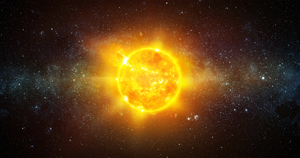

## ☀️ Main-Sequence Note

(  
)

 > 
 > “*And ... [god](Urizen.md) ended his work which he had made; and [he rested](Novel%20experience%20and%20information%20is%20handled%20by%20the%20right%20hemisphere,%20and%20is%20handled%20by%20the%20left%20hemisphere%20once%20it%20becomes%20familiar.md) ...*”

The main-sequence stage is the third stage of the [digestion](Digestion.md) in [☯️ The Flow](🔮%20The%20Cosmos/The%20Flow.md). A note enters the main-sequence when the [⛅️ Proto Note](Proto%20Note) begins to stabilize and consolidate into a clear and distinct idea. Being in a useful state, main-sequence notes are worthy of being submitted into my [spaced repetition](Spaced%20repetition.md) memory system to ensure that i consolidate these ideas into memory and stay engaged them over time. This is a continuation of the [Digestion](Digestion.md) process.

In order for a [⛅️ Proto Note](Proto%20Note) to receive main-sequence status, it must meet the following criteria:

* [Main sequence notes should be atomic](Main%20sequence%20notes%20should%20be%20atomic.md)
* [Main sequence notes should be concept oriented](Main%20sequence%20notes%20should%20be%20concept%20oriented.md)
* [Main sequence notes should be densely linked](Main%20sequence%20notes%20should%20be%20densely%20linked.md)
* [Prefer positive notes titles to promote linking](Prefer%20positive%20notes%20titles%20to%20promote%20linking.md)
* [Prefer note titles with complete phrases to sharpen claims](Prefer%20note%20titles%20with%20complete%20phrases%20to%20sharpen%20claims.md)
* [Prefer associative ontologies to hierarchical taxonomies](Prefer%20associative%20ontologies%20to%20hierarchical%20taxonomies.md)

---

##### References

##### Metadata

Type: #🔵/🔵 
Tags: [PKM](PKM.md) 
Status: #⛅️/⛅️ 
