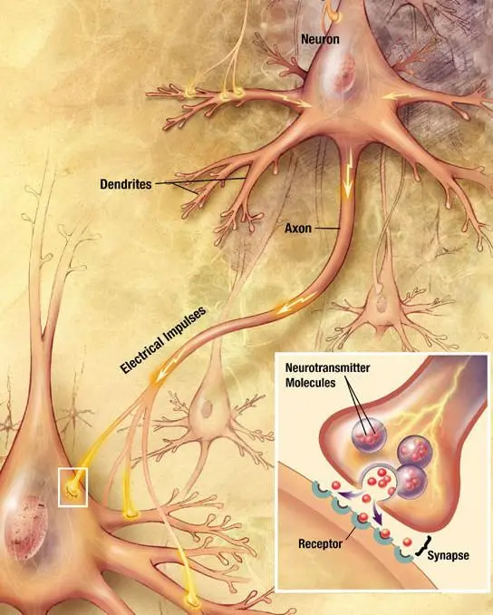

## Neuron  #🧠

Neurons are the basic building blocks of the [nervous system](); their main function is to communicate with each other across tiny junctions called [synapse](Synapse.md)s. While there are many sorts of neurons, their basic design is pretty similar. Each neuron has a [soma]() that makes proteins so the neuron can stay alive. The [soma]() sends out spikes called [dendrite](Dendrite.md)s which receive [neurotransmitter](Neurotransmitter.md)s from other neurons and allow them to communicate with each other. Each neuron also has one long [axon](Axon.md), a special fiber that transmits this information. When a neural impulse is generated in the first [cell](), it pulses down to the end of the [axon](Axon.md), which contains little packets of [neurotransmitter](Neurotransmitter.md)s waiting to be released. The firing [axon](Axon.md) then shoots the [neurotransmitter](Neurotransmitter.md)s across the [synapse](Synapse.md) to bind to the [receptor](Receptor.md)s on the [dendrite](Dendrite.md)s of the next [cell]() either inhibiting it or exciting it to fire. 

---

##### References

* Lustig, H., Robert. (2017). [The Hacking of the American Mind The Science Behind the Corporate Takeover of Our Bodies and Brains Chapter 2. Looking for Love in All the Wrong Places](The%20Hacking%20of%20the%20American%20Mind%20The%20Science%20Behind%20the%20Corporate%20Takeover%20of%20Our%20Bodies%20and%20Brains%20Chapter%202.%20Looking%20for%20Love%20in%20All%20the%20Wrong%20Places.md) (Location 417). New York, NY: *Penguin Random House*.

* Hanson, Rick. (2009). [Buddha's Brain The Practical Neuroscience of Happiness, Love, and Wisdom Chapter 2.The Evolution of Suffering](Buddha's%20Brain%20The%20Practical%20Neuroscience%20of%20Happiness,%20Love,%20and%20Wisdom%20Chapter%202.The%20Evolution%20of%20Suffering.md) (Page 36). New Harbinger Publications: *Oakland, CA*.

##### Metadata

Type: #🔵/🔵 
Tags: [Biology]() / [Neuroscience](Neuroscience.md) / [Anatomy]() / [Neuroanatomy](Neuroanatomy.md)
Status: #☀️ 
