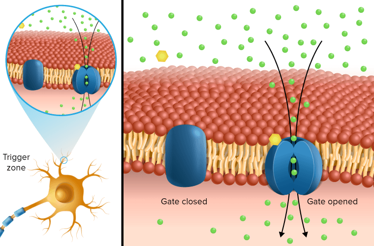

## Receptor  #🧠

Receptors are specialized proteins on the surfaces of [cell]()s where molecules refered to as messengers fit and influence the activity of the cell. Every [cell membrane]() holds many thousands of receptors for many types of messenger molecules. Cells receive input and direction from other parts of the brain and the body and from the outside by means of messenger-receptor interactions. If it wasn’t for their ability to exchange messages with their environment, cells could not function.

---

##### References

* Mate, Gabor. (2010). [In the Realm of Hungry Ghosts Close Encounters with Addiction Chapter 13. A Different State of the Brain](In%20the%20Realm%20of%20Hungry%20Ghosts%20Close%20Encounters%20with%20Addiction%20Chapter%2013.%20A%20Different%20State%20of%20the%20Brain.md) (p. 185). Berkeley, CA: *North Atlantic Books*.

##### Metadata

Type: #🔵/🔵 
Tags: [Biology]() / [Biochemistry](Biochemistry.md)
Status: #☀️ 
