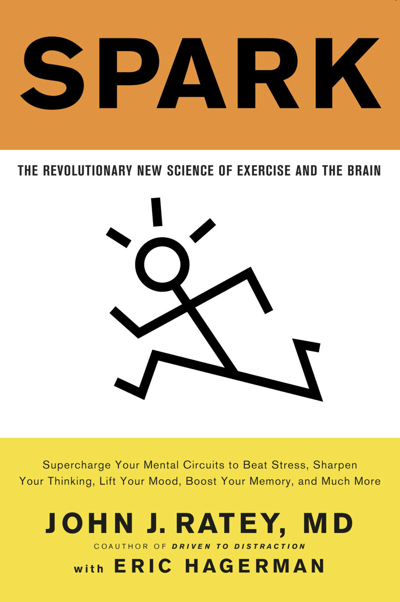

## Spark The Revolutionary New Science of Exercise and the Brain

Author: [John J. Haley](), [Eric Hagerman]()
Publisher: New York, NY: *Little Brown Spark*
Publish Date: 2008
Status: #💫/⏳ 
Rating:

---

### The Book in 3 Sentences

### Impressions

### Who Should Read It?

### How the Book Changed Me

### My Top Three Quotes

### Summary

#### Nebulas

[Inbox scrap 58]()

* [Spark Chapter 2. Learning](Spark%20Chapter%202.%20Learning.md)
* [Spark Chapter 6. Attention Deficit](Spark%20Chapter%206.%20Attention%20Deficit.md)

#### Notes
