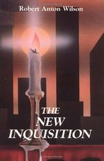

\<- [📚 The Library](🔮%20The%20Cosmos/The%20Library.md)

## The New Inquisition Irrational Rationalism and the Citadel of Science

Author: [Robert Anton Wilson]()
Publisher: Grand Junction, Colorado: *Hilaritas Press.*
Publish Date: 1986
Status: #💫/💫 
Rating: 5/5

---

### Nebulas

* [The New Inquisition Chapter 1. Models, Metaphors, and Idols](The%20New%20Inquisition%20Chapter%201.%20Models,%20Metaphors,%20and%20Idols.md)
* [The New Inquisition Irrational Rationalism and the Citadel of Science Chapter 2. Skepticism and Blind Faith](The%20New%20Inquisition%20Irrational%20Rationalism%20and%20the%20Citadel%20of%20Science%20Chapter%202.%20Skepticism%20and%20Blind%20Faith.md)
* [The New Inquisition Irrational Rationalism and the Citadel of Science Chapter 3. Two More Heretics and Other Blasphemies](The%20New%20Inquisition%20Irrational%20Rationalism%20and%20the%20Citadel%20of%20Science%20Chapter%203.%20Two%20More%20Heretics%20and%20Other%20Blasphemies.md)
* [The New Inquisition Irrational Rationalism and the Citadel of Science Chapter 4. The Dance of Shiva](The%20New%20Inquisition%20Irrational%20Rationalism%20and%20the%20Citadel%20of%20Science%20Chapter%204.%20The%20Dance%20of%20Shiva.md)
* [The New Inquisition Irrational Rationalism and the Citadel of Science Chapter 5. Chaos and the Abyss](The%20New%20Inquisition%20Irrational%20Rationalism%20and%20the%20Citadel%20of%20Science%20Chapter%205.%20Chaos%20and%20the%20Abyss.md)
* [The New Inquisition Chapter 6. “Mind”, “Matter”, and Monism](The%20New%20Inquisition%20Chapter%206.%20%E2%80%9CMind%E2%80%9D,%20%E2%80%9CMatter%E2%80%9D,%20and%20Monism.md) 
* [The New Inquisition Irrational Rationalism and the Citadel of Science Chapter 7. the Open Universe](The%20New%20Inquisition%20Irrational%20Rationalism%20and%20the%20Citadel%20of%20Science%20Chapter%207.%20the%20Open%20Universe.md) 
* [The New Inquisition Irrational Rationalism and the Citadel of Science Chapter 8. Creative Agnosticism](The%20New%20Inquisition%20Irrational%20Rationalism%20and%20the%20Citadel%20of%20Science%20Chapter%208.%20Creative%20Agnosticism.md) 

### Notes
