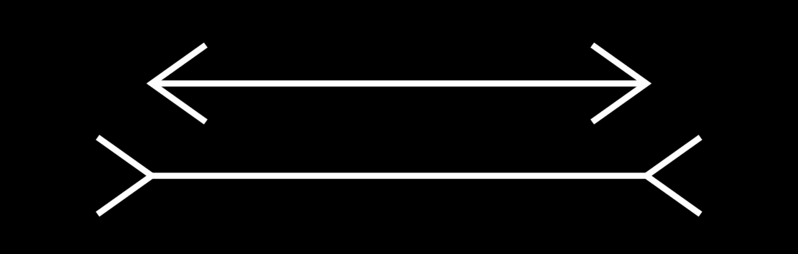

## The brain's perceptual systems actively and pre-consciously interpret and edit their input  #🧠

Many people take the senses to be passive receptors of an objective world. However, much of what you see “out there” is actually manufactured “in here” by your [brain](Brain.md), painted in like CGI in a movie. When the light rays from an object travel to the lens of the [eye](), like all lenses, it reverses them. The [retina]() then registers the reversed "image." We do not see things upside down because the [retina]() is part of a [synergetic](Synergy.md) eye-[brain](Brain.md) system and before we are [conscious](Consciousness.md) of the object, the [brain](Brain.md) has already interpreted and edited the signal into its system of classification, which includes turning the image around and meshing it with the perceptual grid the [brain](Brain.md) uses to file data. In neuroscience, this process is called [predictive coding](Predictive%20coding.md).

For example, consider the Muller-Lyer illusion:

If you see the line on the bottom as longer than the line on the top, your [brain](Brain.md), working on habitual programs, has deceived you. The V and reverse-V decorations seduce the eye-[brain](Brain.md) system into seeing inaccurately. You have just had a mild hallucination. 

[Aristotle]() understood this general principle well enough to point out that the expression "i see" is an incorrect expression and should really be "i have seen." There is always time, however small, between [sense impression](Sense%20impression.md) and the perception in our [brain](Brain.md)s. In that time, the [brain](Brain.md) imposes form, color, meaning, and a great deal else. 

This is the answer to the famous [koan](Koan.md), "Who is the master who makes the grass green?” Color does not exist objectively. Our eyes detect which wavelengths of light bounce off objects and the mind uses this information to create the illusion that we are seeing green. This is not the same, however, as a color such as green objectively existing in the external world.  Before there was life on earth that had evolved eyes to look, there was no sense that grass was green.This only happened after living things invented green in their minds. Or we can also consider sound. Reality is silent, as we understand the term. The collision of objects causes waves to ripple through the air, but this is not the same as ‘sound’ as we subjectively experience it.

---

##### References

* Wilson, A., Robert. (1986). [The New Inquisition Chapter 1 Models, Metaphors, and Idols](The%20New%20Inquisition%20Chapter%201%20Models,%20Metaphors,%20and%20Idols.md) (Page 13 · Location 182). Grand Junction, Colorado: *Hilaritas Press*

* Hanson, Rick. (2009). [Buddha's Brain The Practical Neuroscience of Happiness, Love, and Wisdom Chapter 2.The Evolution of Suffering](Buddha's%20Brain%20The%20Practical%20Neuroscience%20of%20Happiness,%20Love,%20and%20Wisdom%20Chapter%202.The%20Evolution%20of%20Suffering.md) (p. 47). New Harbinger Publications: *Oakland, CA*.

* Wilson, A,. Robert. (1983). [Prometheus Rising Chapter 15 Different Models & Different Muddles](Prometheus%20Rising%20Chapter%2015%20Different%20Models%20&%20Different%20Muddles.md) (Location 2799). Grand Junction, Colorado: *Hilaritas Press*.

* HIggs, John. (2021). [William Blake vs The World Chapter 4 WITHOUT CONTRARIES IS NO PROGRESSION](William%20Blake%20vs%20The%20World%20Chapter%204%20WITHOUT%20CONTRARIES%20IS%20NO%20PROGRESSION.md) (p. 81). New York, NY: *Penguin Random House*.

##### Metadata

Type: #🔴 
Tags: [Psychology](Psychology.md) / [Neuroscience](Neuroscience.md) / [Philosophy](Philosophy.md) / [Semantics](Semantics.md) / [Ontology](Ontology.md) / [Epistemology](Epistemology.md)
Status: #☀️ 
