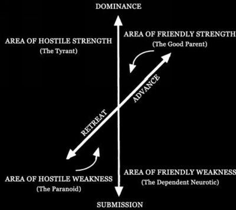

## The four quadrants

The [Emotional-Territorial Circuit](Emotional-Territorial%20Circuit.md) domination-submission creates a two-dimensional social space in conjunction with [Limbic system](Limbic%20system.md) advance-retreat: 

The grid of Circuits I and II creates four quadrants. These four [imprint](Imprint.md)-types are known as:

* [hostile strength](Hostile%20strength.md)
* [friendly strength](Friendly%20strength.md)
* [hostile weakness](Hostile%20weakness.md)
* [freindly weakness](Freindly%20weakness.md)

The irony and the tragedy of human life is that none of these subjects are aware at all of their robotry. Each will explain to you, at great length and with great conviction, why each of their robotic, endlessly-repeated [habit](Habit.md)s are caused by the situations around them, i.e., by the “bad” behavior of other or by "mental illness" ([What the Thinker thinks, the Prover proves](What%20the%20Thinker%20thinks,%20the%20Prover%20proves.md)).

If you put these four primates on a desert island, you can predict, with virtually as much certainty as a chemist telling us what will happen if four elements are compounded, that Subject #1 and #4 (Friendly Strength and Hostile Strength) will both try to take over—#1 to help the others, #4 because SHe can’t imagine anybody else in control. #1 will submit to #4 because #1 wants things to run smoothly for the good of all, and they never will run smoothly if #4 is not TOP DOG. #2, Friendly Weakness, will not care whether #1 or #4 rules, just so long as somebody else is making the decisions. And #3 will complain (and complain, and complain), no matter who is in charge, while skillfully avoiding any action that would require taking personal responsibility.

---

##### References

* Wilson, A., Robert. (1983). [Prometheus Rising Chapter 4 The Anal Emotional Territorial Circuit](Prometheus%20Rising%20Chapter%204%20The%20Anal%20Emotional%20Territorial%20Circuit.md) (Location 777). Grand Junction, Colorado: *Hilaritas Press*.

* Wilson, A., Robert. (1983). [Prometheus Rising Chapter 4 The Anal Emotional Territorial Circuit](Prometheus%20Rising%20Chapter%204%20The%20Anal%20Emotional%20Territorial%20Circuit.md) (Location 838). Grand Junction, Colorado: *Hilaritas Press*.

##### Metadata

Type: #🔴 
Tags: [Biology]() / [Neuroscience](Neuroscience.md) / [Sociobiology]() / [Neuropsychology](Neuropsychology.md) / [Evolutionary Psychology]()
Status: #☀️ 
