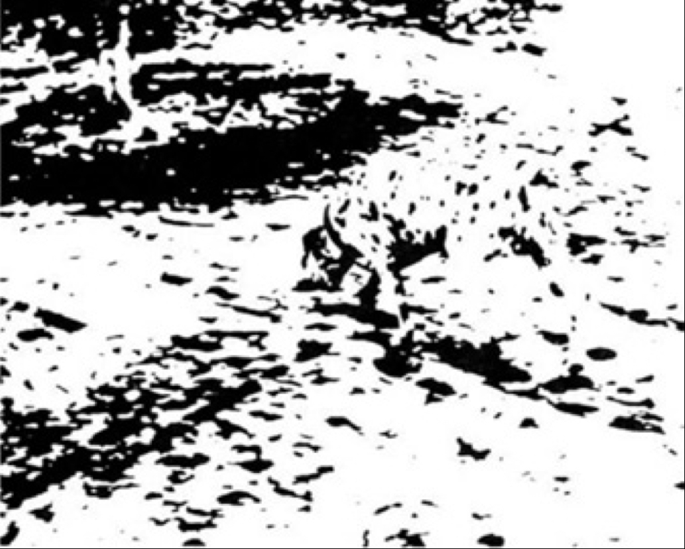

## The right hemisphere sees the whole before the left hemisphere separates it into parts

[The global attention of the right hemisphere precedes the narrow attention of the left hemisphere](The%20global%20attention%20of%20the%20right%20hemisphere%20precedes%20the%20narrow%20attention%20of%20the%20left%20hemisphere.md), and predicatively the [right hemisphere](Right%20hemisphere.md) sees the whole, before whatever it is gets broken up into parts by the [left hemisphere](Left%20hemisphere.md) in our attempt to ‘know’ it. Its holistic processing of visual form is not based on summation of parts. On the other hand, the [left hemisphere](Left%20hemisphere.md) sees part-objects. The best-known example of this process of [right hemisphere](Right%20hemisphere.md) Gestalt perception is the way in which the Dalmatian dog, sniffing the ground in the shade of a tree, suddenly emerges from this mass of dots and splashes:

The process is not a gradual putting together of bits of information, but an ‘aha!’ phenomenon—it comes all at once. The [right hemisphere](Right%20hemisphere.md), with its greater integrative power, is constantly searching for patterns in things. In fact its understanding is based on complex pattern recognition. This is why the [right hemisphere](Right%20hemisphere.md) is so often connected with “intuition,” which is a way of thinking between and around data-points on the perceptual screen—sensing what total field the points must be part of.

---

##### References

* Mcgilchrist, Iain. (2010). [The Master and His Emissary Chapter 2 What Do the Hemispheres Do](The%20Master%20and%20His%20Emissary%20Chapter%202%20What%20Do%20the%20Hemispheres%20Do.md) (96). London, UK: *Yale University Press.*

* Wilson, A., Robert. (1983). [Prometheus Rising Chapter 11 The Holistic Neurosomatic Circuit](Prometheus%20Rising%20Chapter%2011%20The%20Holistic%20Neurosomatic%20Circuit.md) (Location 2184). Grand Junction, Colorado: *Hilaritas Press*.

##### Metadata

Type: #🔴 
Tags: [Biology]() / [Neuroscience](Neuroscience.md) / [Neuropsychology](Neuropsychology.md) 
Status: #☀️ 
