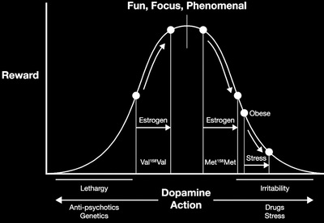

## There must be a balanced amount of dopamine in the mesolimbic pathway to prevent lethargy or irritablility   #🧠

If you have too little [dopamine](Dopamine.md) in the [mesolimbic pathway](Mesolimbic%20pathway.md), you're a laconic couch potato; too much of it and you become aggresive and paranoid. in other words, there is a sweet spot, an optimal level within the dynamic range of experience where the system functions at its best. This can best be illustrated by a bell-shaped curve, which one can travel along backward and forward, depending on your psychological state. If you're on the low end of the curve (on the left), you have little motivation for reward. A slight upswing to the right from a [dopamine](Dopamine.md) boost can help liven up your mood and bring feelings of exitement. But if you're already at the top of your bell-shaped curve, and you get that same [dopamine](Dopamine.md) boost, it can result in a new state that is quite unpleasant. Moreover, your current position on that bell-shaped curve can be changed by your experiences with the many forces, including stress and medicines, that your exposed to everyday. 

---

##### References

* Lustig, H., Robert. (2017). [The Hacking of the American Mind The Science Behind the Corporate Takeover of Our Bodies and Brains Chapter 3. Desire and Dopamine, Pleasure and Opioids](The%20Hacking%20of%20the%20American%20Mind%20The%20Science%20Behind%20the%20Corporate%20Takeover%20of%20Our%20Bodies%20and%20Brains%20Chapter%203.%20Desire%20and%20Dopamine,%20Pleasure%20and%20Opioids.md) (Location 652). New York, NY: *Penguin Random House*.

##### Metadata

Type: #🔴 
Tags: [Biology]() / [Neuroscience](Neuroscience.md) / [Biochemistry](Biochemistry.md) / [Neurochemistry](Neurochemistry.md) 
Status: #☀️ 
