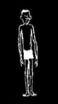

## Those who take their heaviest imprint on the Semantic Circuit tend to grow up cerebrotonic

Those extreme cases who take their heaviest [imprint](Imprint.md) on the [Time-Binding Semantic Circuit](Time-Binding%20Semantic%20Circuit.md) tend to grow up cerebrotonic. They are tall and skinny, because energy is perpetually drawn upward from the body into the head. The caricatured evil genius, Dr. Syvlanus in Superman, who was virtually all head, represents the extreme toward which this type seems to be evolving. Popular speech calls them “eggheads.” Almost always, these cerebrotonic Semantic Circuit types ignore or are hostile to their [Limbic system](Limbic%20system.md) and [Emotional-Territorial Circuit](Emotional-Territorial%20Circuit.md) functions. Playfulness puzzles them (appears silly or eccentric) and emotions both baffle and frighten them.

---

##### References

* Wilson, A., Robert. [Prometheus Rising Chapter 6. The Time-Binding Semantic Circuit](Prometheus%20Rising%20Chapter%206.%20The%20Time-Binding%20Semantic%20Circuit.md) (Location 1128). Grand Junction, Colorado: *Hilaritas Press*.

##### Metadata

Type: #🔴 
Tags: [Biology]() / [Neuroscience](Neuroscience.md) / [Physiology]() / [Neurophysiology]() / [Psychology](Psychology.md) / [Neuropsychology](Neuropsychology.md)
Status: #☀️ 
