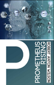
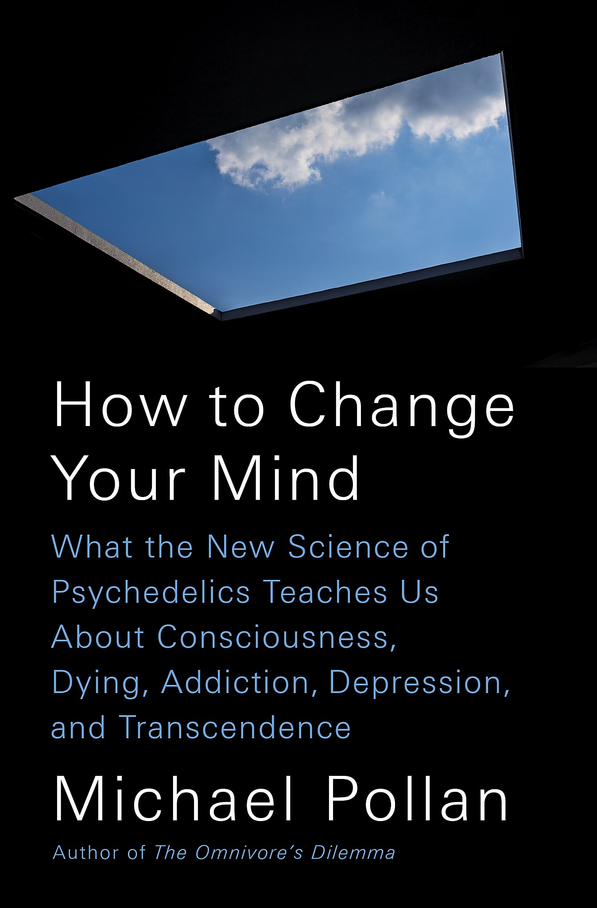

#  The Library

The Library is contains the sources that have fed [🔮 The Cosmos](The%20Cosmos.md). Click on any source to see highlights, summaries, and/or notes for that source. Some of these are full books, others may just be certain chapters or web articles.

### Favorites

 \[  \]

### Other Reading Lists:

* [All Sources](../All%20Sources.md)
